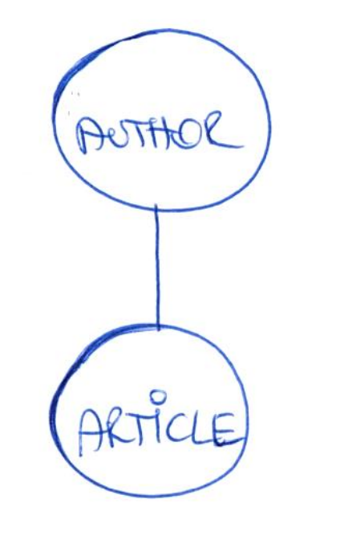
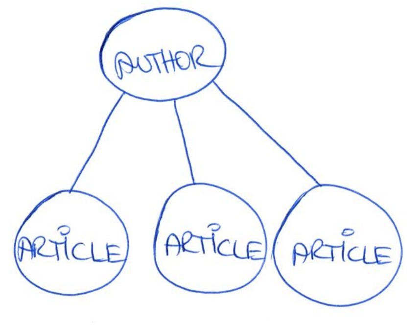
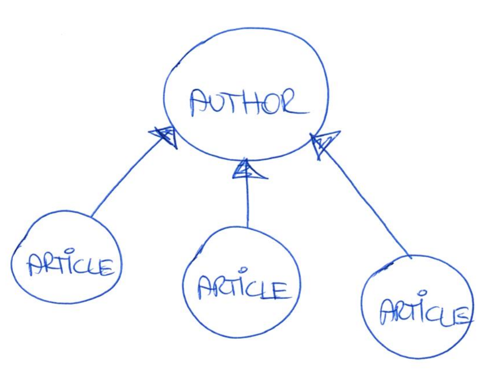
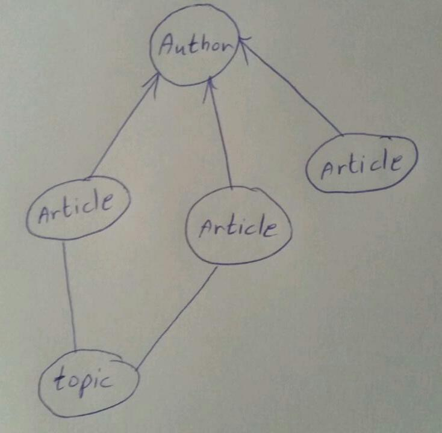
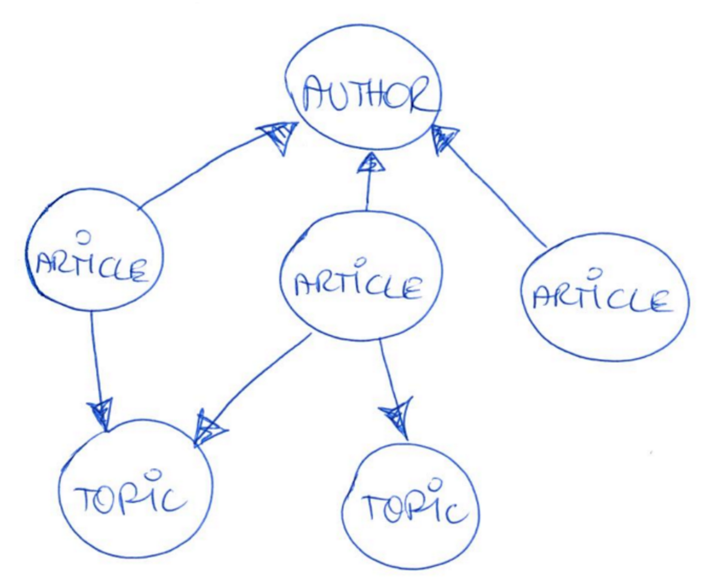
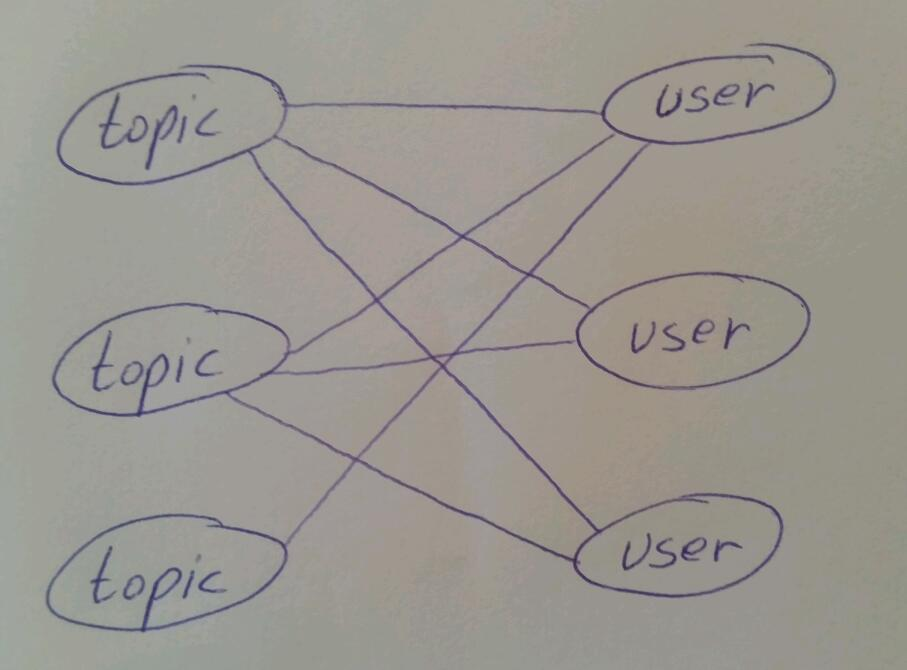
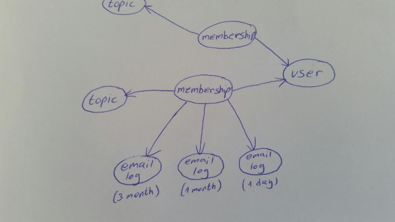

# How to approach a new task, and its underlying data structure

When approaching a new task, it may seem overwhelming because you don’t know from where to start.

In this chapter we will present a method that includes a few steps of logical thinking to help you find the starting point. The task is understanding the set of requirements for implementation and it is done by first finding the underlying data structure.

A task is often composed of many small parts. We need to break the "problem" down to atom parts and reveal the entities and the relationships between them. It is ultimately a world of circles, lines, and arrows.

Take a look at the following simple scenario:

> Authors can write articles.

Let's try to identify the entities and relationships in this scenario. An amazingly quick and simple way to do it is to draw it by hand. Use circles for entities and lines for the relationships between them.

That wasn't so hard, was it? In this case, the entities are `author` and `article`.  The line indicates that they are somehow related.

A relationship defines how entities relate, so we can use arrows to express the reference between the entities. In order to know the direction of the arrow, we should ask two important questions:

**Question 1:** Can the author write more than one article?

Answer: Yes, she can! So, let's represent that in the sketch. It would look like this:

And, if our author is particularly diligent, she can even write a million articles (theoretically of course), so this brings us to the next important question:

**Question 2. The Million Question** Can and should a single `author` entity refer to a million `article` entities?

Answer: No, the answer is definitely not. It would be a bad idea.

To understand this, we need to talk about the **meaning of reference**. When object A refers to object B it means object A “knows” about object B. This "knowing" becomes part of the information that object A holds.  So for example when we call object A from the database, it might also retrieve the information of all the "B" objects that it refers to. So, if theoretically there can be a million "B" objects, the system would retrieve them all. This is a very heavy task for the system that requires a lot of memory resources. We want to avoid this.

Therefore we don’t want the `author` to refer to a million `articles`. The `article` will refer to (know about and hold the information on), the `author`.

It looks like this:

Now let's add more details to our scenario:

> Author can write articles on various topic(s).

What is this new topic? Simple - It's an entity, represented as a circle.
How does `topic` relate to the other entities?
Articles are written on particular topics, so the `article` and the `topic` have a relationship.

Now, what is the direction of the relationship? That is, what is referring to what? Let's apply our questions to answer this:

Question 1: Can one `topic` be written about in more than one `article`? Yes.

Question 2 (The Million Question): Can and should one single `topic`refer to a million `article`? No, we don't want that.

Now ask the same questions from the other direction:

Question 1: Can one `article` be written in more than one `topic`? Yes, that is the requirement.

Question 2 (The Million Question): Can and should one single `article` refer to a million `topic`?
This is where reality dictates the answer. While in theory an article could reference a million topics, we know that this won't be the case. A typical article (blog post) will probably have a single or few topics. So, it is safe to say, that based on the limitation which is derived from the fact we are building _real_ sites and not answering academic papers, the `article` refers to the `topic`.

### Advanced requirements

Up until now nothing was too complicated. Even if you are not a web developer, you are probably comfortable with the above logic. You may be tempted to think that the below scenerio will require some deep understanding of computer science. It doesn't!

The above logic can assist us even with the next scenarios:

> We are going to build a premium Website that contains articles. People can sign-up and register to one or more topics of interest. Registering to a topic means that they can read articles that belong to it.

In this scenerio, we can use the general word for the people who use the system - `user`. In the previous scenerio we called the `user` entity by the more specific name `author`but essentially they are the same.

We know that the `user` has a relationship with a `topic` so we draw a line between them.

Question 1: asked in both directions
Can a `user` register for more than one `topic`?
Can a `topic` be chosen by more than one `user`?

The answer 'yes' to this question (in both directions) is draws like this:

Question 2 (The Million Question):
Can and should one single `topic` refer to a million `user`?
Can and should one single `user` refer to a million `topic`?

Hmm, seems we have a real problem here! A single `user` cannot reference million `topic`, and vice versa. Is the universe going to collapse into itself?!

Worry not, because we have an elegant solution for cases like this. We'll use a new entity! We will place it in between the other two entities to solve the out-of-control referencing of a million in both directions.  
We call this "revealing the entity", as sometimes an entity will be hidden in the requirements and not get an explicit name. In our case we can call it `membership` and it will represent a specific registration (or a membership) of a user to a topic. Now every `user` has only one single `membership` per `topic`.

By having a special entity for capturing the membership, we can also add more meta-data. For example we can capture the state of the membership - is the user an active member, pending or even blocked. We can also have a timestamp property to register the exact second for when the membership was created.

Side note: It's worth mentioning that this `membership` entity and its references is the base concept for the Organic Groups module in Drupal.

Lets continue, it seems our client has more needs for their premium website.

> Registration should expire after a year. The member will get a reminder emails after 3 month, 1 month and 1 day before expiration. If not renewed, the membership should be set to pending.

What information do we need in order to send the reminder emails?

We need to know, of course, when the membership began, so we can calculate when 9 months have passed to send the first reminder email. Luckily we have the `created` property holding the timestamp.

Next, the requiremenets have implied another property we mentioned - the membership `state`. If a user will not renew their membership we will not delete it, but rather set it to be `Pending`.

Now where we have the membership and its properties in place, we can think about how to retrieve the memberships that need notification from the database. Let’s describe in semi-technical words the query:

Give me all `membership` that their `state` is `active` and their `created` is `today's date minus 9 month`.

Getting closer, but there is still one more thing to consider - we need to check that we don't send the email too many times to the same user. How do we make sure that we don't send a notification for the same `membership` over and over again?

So it's becoming obvious we'll need to save the information for which `membership` emails were already sent, however it's still not clear _where_ are we going to save this information?

Is it going to be at the `user` entity? Well, remember that `user` can have more than one `membership` (potentially a million), so we can't hold that information there.

Additionally, the emails sent are based on the _membership_ itslef. So maybe we can hold that information there? It's possible, but it won't be the best solution. Lets say we have 3 checkboxes marking each email that was sent.  
Now, even though it was not in the requirements, we might want to know what time exactly the email was sent. You know, bugs happen, and we need data to debug it.

But with the checkboxes on the `memebership` entity, that meta-data is not present.

Meta data? On some piece of data? Sounds familiar? Yeah, the `membership` entity can hold valuable meta-data on the relation. We had to reveal the entity.

I hope that by now, you will not be too surprised that we will reveal another entity. Lets call it `email log` - It's an entity that logs a single email. It's like a snapshot of one specific email sent to one specific user, based on a single membership.

Can you think about the references of that entity? What are the properties it is holding?

Who will reference who - `membership` -> `email log`, or vice versa?
Let's ask the questions

Question 1: Can one `membership` have more than one `email log`? Yes. But, we know from this case that it is also limited to a maximum of three `email log`.

In that case the answer is  - it can be both. We would probably go in this case with a `membership` referencing the `email log`, just because it would be slightly easier later to get the membership along with its related emails.

Finally, let's describe the query again:

Give me all `membership`s that their `state` is `active`, and their `created` timestamp is `today's date minus 9 month`, and that does not show up in an `email log` (because we have _not yet sent an email_ to the user who created this membership).

###Summary:

In our websites development, we are faced with new tasks on a regular basis. A complex task should be broken down to smaller and simpler tasks. Alwats start by defining the data structure and the relations between them:
1. Define the entities. No matter how complex the task is, always start from drawing the first circle (entity) and then continue to the next one.
2. Define how entities are related. Draw a line between them.
3. Determine if there can be multiples of the same entity with Question 1: Can `entity A` be related to more than one `entity B`?
4. Define the relationships between the entities - what refers to what? Use "The Million Question" to help you out. Can and should one single `entity A` refer to a million `entity B`? Add the arrows to the lines.
5. Remember you can create an additional entity in cases of complex relationships between two entities.
6. Describe your "asking for data" (i.e. query) in semi-technical words, don't jump to the DB implementation.
