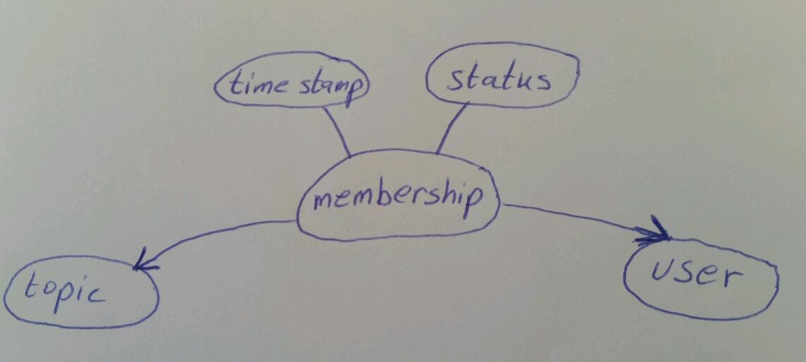
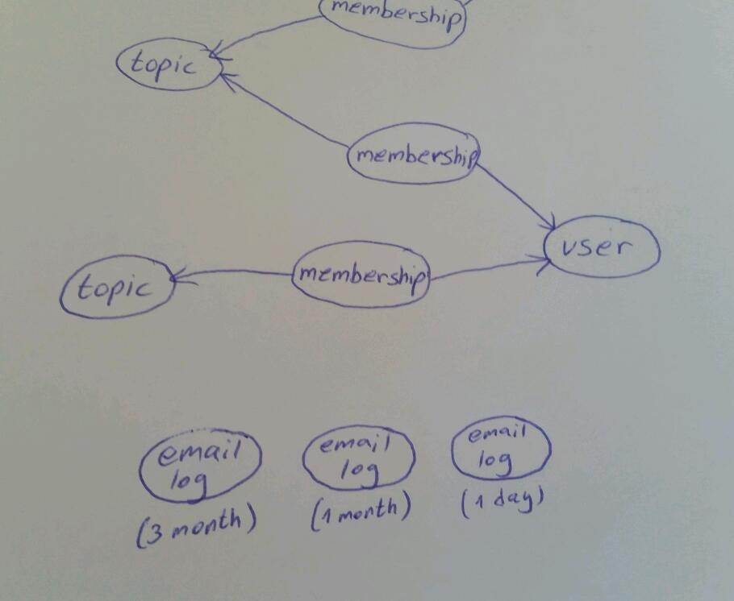

# Approaching a Task - determining a website's technical structure 

When you need to deal with new task, sometimes things seem confusing and even a simple task may be overwhelming because you don’t know from where to start.

In this chappter we will present a method that includes a few steps of logical thinking to help you find the starting point from which to approach a task. A task being understanding how to implement a set of requirements, by first finding the underlying data structure.

A task is often composed of many small parts. We need to break the "problem" down to atom parts and reveal the entities and the relationships between them. It is ultimately a world of circles and arrows.

Take a look at the following simple scenario: 


> Authors can write articles.


Let's try to identify the entities and relationships in this simple scenario. An amazingly quick and simple way to do it is to draw it by hand. Use circles for entities and lines for the relationships between them.


That wasn't so hard, was it? In this case, the entities are `author` and `article`.  The line indicates that they are somehow related.

A relationship defines how entities relate, so we can use arrows to express the reference between the entities. In order to know the direction of the arrow, we should ask two important questions:

**Question 1:** Can the author write more than one article?

Answer: Yes, she can! So, let's represent that in the sketch. It would look like this:


And, if our author is particularly diligent, she can even write a million articles (theoretically of course), so this brings us to the next important question we call:

**Question 2. The Million Question** Can and should a single `author` entity refer to a million `article` entities?

Answer: No, the answer is definitely not. It would be a bad idea. 

To understand that we need to understand the **meaning of reference**. When object A refers to object B it means object A “knows” about object B, and this "knowing" becomes part of the information that object A holds.  So for example when we call object A from the database, it might also retrieve the information of all the "B" objects that it refers to. So, if theoretically there can be a million "B" objects, the system would retrieve them all. This is a very heavy task for the system that requires a lot of memory resources. We want to avoid this.

Thus, because we don’t want the `author` to refer to a million `articles`, the `article` will refer to (know about and hold the information on), the `author`.

It looks like this:


Now let's add more details to our scenario:


> Author can write articles on various topic(s).


What is this new topic? Simple - It's an entity, represented as a circle.
How does `topic` relate to the other entities?
Articles are written on particular topics, so the `article` and the `topic` have a relationship.


but what is the relationship direction. That is, who is referring to who? Let's apply our questions to answer this:

Question 1; Can one `topic` be written about in more than one `article`? Yes.

Question 2; (The Million Question) Can and should one single `topic`refer to a million `article`? No, we don't want that.

Now use the questions the other way around:

Question 1 Can one `article` be written in more than one `topic`? Yes, that is the requirement

Question 2 (the Million Question); This is where the reality should help us dictate the answer. While in theory an article could reference a million topics, we know that won't be the case. A typical article/ blog post is probably under a single or a few of topics. So it should be safe to say, that based on the limitation which is derived from the fact we are building _real_ sites and not answering academic papers, we can safely sat that the `article` will refer the `topic`. 

Here it is represented by the arrows:


Our story continues... 


> We are going to build a Premium Website that contains articles. People can sign-up and register to one or more topics that interest them. Registering to a topic means that they can read articles that belong to it.


Now we have new entity: people.  Let's call it `user`.

Question 1: Does a `user` have a relationship with a `topic`?
Can a `user` register for more than one `topic`?
Can `topic` be chosen by more than one `user`?

Well, user can register to many topics and many users can register to the same topic, so we will get something like this:


Question 2: (The million question) In this case, it gets a bit complicated, huh?! It can be a million users and a million topics... how can we solve it? 
We can add another entity, called `membership`. It will represent a specific register of user to a topic. Now every user has only one `membership` per topic.


In this case `membership` refer to `topic` (because we don’t want `topic` refer to million `membership`). `membership` also refer to `user` (because we don’t want `user` refer to million `membership`). It looks like this:


Continue with our story - 


> Registration expired after a year. The user will get a reminder emails - 3 month, 1 month and 1 day before expired, so he can renew his registration.
 

What information do we need in order to send the reminder emails?

We need to know of course when the membership began, then we can calculate when 9 months has passed and send the first reminder email. In technical words, the beginning date (or any other date represent something occurs in the system), calls `timestamp`.

But this information is not enough. Think about situation user decide not to renew his registration, what happened to his membership? Is it going away, delete from the system? Well, usually we don’t delete content from the system, but we can mark it as inactive.

So in order to send the user reminder, we need to know two things:  the membership created date (i.e `timestamp`) and if it is active or not (i.e `status`).



Now we have all the information we need for sending the first reminder email (the one that comes after 9 month), so in order to know to which user we need to send that email, we need to retrieve from the database the right user. 
Let’s describe in words the query for getting the right information from database:


Give me all `membership` that their `status` is **active** and their `timestamp` is **today's date minus 9 month**.


Ok, we almost there, but there is still one more thing - we need to check that we don't send the email more then one time to the same user. Assuming that we have a lots of `membership` in our database, so we need to limit the number of `membership` we get every time we run the query (if the system will bring us all the fit `membership` at ones, it can be run out of memory). So for example we will tell the system to brings us only 100 `membership` at a time, and we will run the query every 5 min. 

How do we make sure that the system won't bring us the same `membership` we already sent email for 5 min ago?

We need to save the information for which `membership` we already sent emails, and check it every time we want to send reminder email.
But where are we going to save this information?
Is it going to be at the `user` entity? Well, remember that `user` can have more than one `membership`, so it will be very complex to put all this data at the `user` entity. Additionally, the email sends based on a membership's timestamp, so it makes more sense that the `membership` will hold the information about the emails who was send. Well, this won't be good enough ether, because we need to send three emails (3 month, 1 month and 1 day before the membership expire), and it's to much data to put at at the `membership` entity.

In that case it will be better to create new entity. Let's call it `email log`.




Now we need to define the relationship. the `email log` has relationship with `membership` (and not with the `user` if you happen to think so) because we already mentioned that an email sent based on a `membership` data (`timestamp` and `status`).
We know `membership` and `email log` have a relationship, but what refers to what (direction of the arrow)?

**Question 1:** can one `membership` has million `email log`? No it can has maximum three `email log` . 

Because the answer is no, we don't need to ask the million question. we can decide that `membership` will refer to `email log`, because when we retrieve `membership` from the database, we want to get also the information about the `email log`.


Finally, let's describe the exact query:


Give me all ```membership``` that their ```status``` is **active**, and their ```timestamp``` is **today's date minus 9 month**, and we didn't sent email yet to the user who created this membership.


**Summary:**

In our developing websites world, we are facing with new tasks on a regular basis. Even a complex task can be simple to approach if we adopt clear principles:
1. Define the entities. No matter how complex the task is, always start from drawing the first circle (entity) and then continue to the next one.
2. Define the relationships between the entities - what refer to what. Use 'The million question' to help you out.
3. Remember you can create additional entity in case we have complex relationships between two entities. 
4. Describe your "asking for data" (i.e. query) in human words, don't jump to use technical words.


