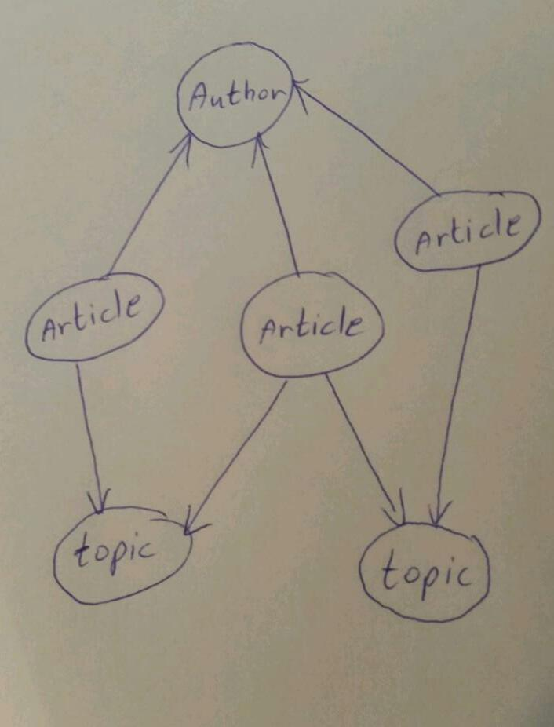

# Approaching a Mission - determining a website's technical structure. 

As a newbie, a lot of things seem very confusing and sometimes even a simple task may be overwhelming because you don’t know from where to start. Well, no need to reinvent the wheel, once you adopt a clear approach to a problem, with defined rules, ever the most complex task becomes approachable and less threatening.

In this post I will try to present a method that includes a few steps of logical thinking to help you find the starting point from which to approach a mission. A mission being the determination of a website's technical structure.

First of all, we can think about a mission as a story plot with characters. A well written and understood story plot includes clearly defined relationships between the characters.

In our technical world, characters are called entities, and the first step to understanding the story, our new mission, is to be able to recognize the entities and the relationships between them.

Let's take a look at a simple story: 

**An author writes articles.**

Let's try to identify the entities and relationships in this story - the best way to do it - is to draw it! Use circles for entities and lines for relationships.

In this case, the entities are "Author" and "Article".  The line indicates that they are related.

A relationship defines how entities are related to one another, so we better use arrow line to express the reference between the entities. In order to know the direction of the arrow, we should ask two important questions:
1. Is the author can write more than one article?
Yes, he can! So it will look like this:

And if our author is particularly diligent, he can write even a million articles (theoretically of course…), so this will bring us to the second important question, we call it “the million question”: 
2. Is the entity “author” can refer to million entities “article”?
No, the answer is definitely not. To understand that, we need to understand the meaning of reference. When object A refer to object B it means object A “knows” about object B, and this “knowing” became part of the information that object A holds.  So when we call object A from the Database, it will brings us also the information of all the “B”s objects that it refer to. So if there are milion “B”s objects, the systems brings them all. This is a very heavy task for the system to deal with and needs a lot of memory resources … We want to make it easier for the system and not make it difficult for her. 

So because we don’t want “author” refer to million entities “article”, the “article” is refer to “author”. 
It will look like this:

Now let’s add more details to our story:

**Author writes articles in various topics.**

Now we have another entity “topic”. How does “topic” relate to the others entities?
Article written on a particular topic, then the ״article״ and the “topic” have a relationship.

And who refer to whom? (what is the arrow direction?)
Let’s ask the “million question” - 
Is one topic can has more than one article? Yes.
Is one article can written on more than one topic? Theoretically yes, but for the practice we decide that every article belongs only to one topic, so the answer to this question is No.

//pic5a 

//pic5b

Our story continue - 

**We going to build a Premium Website, contains articles. People can signup and register to one or more topic that interest them. While they register to a topic, they can read articles belong to it.**

Now we have new entity: People.  Let's call it “User”.

Is “user” has relationship with “topic”?

Well, user can register to many topics and many users can register to the same topic, so we will get something like this:

Try to answer the “million question” for this case… a bit complicated, huh?! It can be a million users and a million topics...
So, to make it simple, we can add more entity - let’s call it “Membership”, and it will represent a specific register of user to a topic.

In that case “Membership” refer to “Topic” (because we don’t want “Topic” refer to million “Membership”) and ““Membership” also refer to “User” (because we don’t want “User” refer to million “Membership”). It looks like this:

Let us continue with our story - 

**Registration expired after a year. The user will get a reminder emails - 3 month, 1 month and 1 day before expired, so he can renew his registration.** 

What information do we need in order to send the reminder emails?
We need to know of course when the membership began, then we can calculate when 9 months has passed and send the first reminder email. In technical words, the beginning date (or any other date represent something occurs in the system), calls “time stamp.

But this information is not enough. Think about situation user decide not to renew his registration, what happened to his membership? Is it going away, delete from the system? Well, usually we don’t delete content from the system, but we can mark it as inactive.
So in order to send the user reminder, we need to know two things:  the membership’s created date (i.e "time stamp") and if it is active or not (i.e "status").

Ok, so now we have all the information we need for sending the first reminder email (the one that comes after 9 month), so in order to know to which user we need to send that email, we need to retrieve from the database the right user. 
Let’s describe in words the query for getting the right information from database:

**Give me all “membership” that their “status” is *active* and their “time stamp” is *today's date minus 9 month***

Ok, we almost there, but there is still one more thing - we need to check that we don't send the email more then one time to the same user. Assuming that we have a lots of "membership" in our database, so we need to limit the number of "membership" we get every time we run the query (if the system will bring us all the fit "membership" at ones, it can be run out of memory). So we will tell the system to brings us only 100 "membership" at a time, and we will run the query every 5 min. 
How we make sure that the system won't bring us the same "membership" we already sent email for them 5 min ago?
Of course we need to save an Email log, and check it every time we want to send reminder email.

so let's add new entity call "email log"
Remember that we going to have 3 emails send per membership: 3 month before expired, 1 month before and 1 day before.

Now we need to define the relationship. the "email log" has relationship with "membership" (and not with the "user" if you happen to think so) because an email sent based on a membership's time stamp. It is data that the "membership" holds and not the "user".
So "membership" and "email log" have a relationship, but who refer to whom?
Is one "membership" can has million "Email log"? No it can has only three "email log" maximum. So in this case we prefer the "membership" will refer to "email log" so when we retrieve from the database the "membership" we get also the information about the "email log".

Finally, let's describe the exact query:

**Give me all “membership” that their “status” is *active*, and their “time stamp” is *today's date minus 9 month*, and we didn't sent email yet to the user who created this membership.**

Summary:

