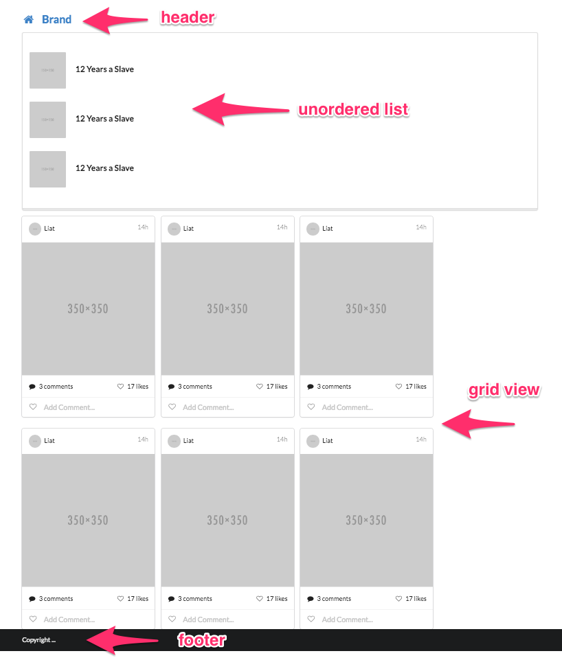
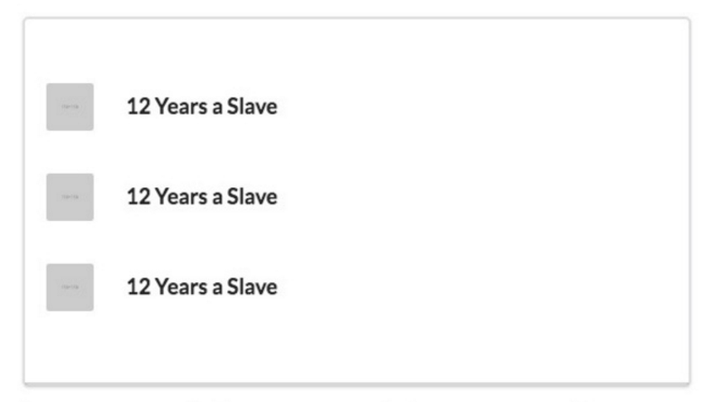

# CTools plugins

Our working method is to build a static site with jekyll and then make it dynamic, by copying HTML and CSS to the Drupal site, and replacing the static parts with dynamic content. You can read more about this method in [Gizra blog](http://www.gizra.com/content/custom-css-as-contrib-with-jekyll/).

In this training we will focus on a particular part of the implementation of this method, by using two powerful drupal’s modules: [CTools](https://www.drupal.org/project/ctools) and [Panels](https://www.drupal.org/project/panels).

One of the great tools of CTools is the Plugins.
CTools plugin is a piece of code located in small file (.inc), which help us to extend any module functionality.
Panels provides content areas exposed as block or page. We use the panel as a container to display our plugin.
In this post we'll go through a few steps, show how to create and use CTools plugins with Panels.


### 1 - Recognize the plugin in the Markup
First we need to look at the Markup and recognize the piece of code that we going to make a plugin for.
For example, look at this page:



We can identify three parts: **header**, **footer** and **content**. The content area contains two items lists: one is a list view and the second is a grid view. Header and footer repeat on every page, so they will be part of our layout. Every item in the list is a piece of code that repeat itself, so we can look at one list as a plugin. In this page we have two lists, so we will create separate plugin for each list.

The final code for the examples below can be found in [this repository](https://github.com/Gizra/dynamic_example/tree/lesson1).

Let’s look at the code in the static site. 
Go to ```/static/src/hello-world/index.html``` and open the file.

```
---
layout: default
label: Hello-world
---

<div class="ui segment stacked">
  <div class="ui very relaxed items">

    
    
    


  </div>
</div>

<div class="ui link cards">


  
  
  
  
  
  
  
</div>
```

We see that the code for the item in the list view is in ```single_item.html``` - it will be the first plugin, and the code for the item in the grid view is in ```card.html``` - it will be the second plugin.
Also we can see the layout for this page is ```default```. So let’s take a look at the layout. Go to ```/static/src/_layouts/default.html```.

```
<body>

    

    <main class="ui container">
      {{ content }}
    </main>

    

    <script src="/assets/javascript/script.js"></script>
  </body>
```
Here, inside the ```<body>``` tag, we see first the **header** (which his code is in ```header.html```), then the **content** (inside the ```<main>``` tag), and final the **footer** (which his code is in ```footer.html```)

Now, after we saw the parts of the page, and identified the plugins, we can go ahead and start building them.


### 2 - Create new theme.
In the project directory, within the theme directory, create a folder called 'MYTHEME' (replace MYTHEME with the name of the new theme). Within this folder create MYTHEME.info file which contain some simple instructions to help Drupal identify and use our theme. For example you can look at ```dynamic_example/themes/dynamic_example_theme/dynamic_example_theme.info``` 

Next, within MYTHEME folder create folder called ```templates```.
Inside this folder we need to place the ```page.tpl.php``` file. This file is the default template file to display a single Drupal page. Copy it from ```/www/modules/system/page.tpl.php``` and paste it into ```templates``` folder.


```
theme/
   MYTHEME/
      MYTHEME.info
      templates/
         page.tpl.php
```

Now, let’s go back to our markup. Remember we recognized three parts of the page: **header**, **footer** and **content**. That is the layout of the page, so we need to replace the ```page.tpl.php``` default code with the HTML of this layout. 
But, before we do any changes in our ```page.tpl.php```, we need to make sure Drupal reads this file from our theme folder. To check this, all we need to do is to delete all the file’s content (don’t worry, it can be reversible), and write something like ‘*My theme*’. Then go to the browser and clear cache of your Drupal site. If you see the words ‘*My theme*’ it means Drupal notice to ```page.tpl.php``` in our theme folder. Undo deletion (by cmd+z).


### 3 - Edit page.tpl.php file.
As we said, we need to place the HTML from the Markup layout into Drupal site. 
In the project directory, go to ```/static/src/_includes/header.html```. Copy the content of this file and paste it in the top of your ```page.tpl.php``` file.
Then copy the ```<main>``` tag and all it contains from ```/static/src/_layouts/default.html```.
Finally go to ```/static/src/_includes/footer.html``` and copy it’s content too.
The result should be look like this:

```
<header class="ui container header">
  <h2 class="ui header">
    <a href="/"><i class="home icon"></i></a>
    <a href="/">Brand</a>
  </h2>
</header>

<main class="ui container">
  {{content}}
</main>

<footer class="ui inverted vertical footer segment">
  <div class="ui container">
    Copyright ...
  </div>
</footer>
```

This code now is in our drupal page, but it’s completely static, exactly like our markup. Let’s replace the static parts with a dynamic content. In the original ```page.tpl.php``` code, find the line where Drupal prints the content. Cut and paste this line inside the ```<main>``` tag, where the content should be print. Additionally we want to see the drupal messages, so cut the relevant line and paste it above the ```<main>``` tag. Now your code should look like this:

```
<header class="ui container header">
  <h2 class="ui header">
    <a href="/"><i class="home icon"></i></a>
    <a href="/">Brand</a>
  </h2>
</header>

<?php print $messages; ?>

<main class="ui container">
  <?php print render($page['content']); ?>
</main>

<footer class="ui inverted vertical footer segment">
  <div class="ui container">
    Copyright ...
  </div>
</footer>
```

That’s all we need. Delete the rest of the original code in ```page.tpl.php```.


### 4 - Create Panel page
In drupal site, go to ```/admin/structure/pages``` and create a page. Give it title and path, choose 1 column layout and leave content empty for now. Later we will add the plugin to the content area.
Save the panel page and export it by Features. Put the module in ```/modules/custom/MYMODULE```. Don’t forget to enable the module.


### 5 - Create the plugin
First, we need to define a hook to tell CTools where our plugin is located. Open the file ```/modules/custom/MYMODULE/MYMODULE.module``` and paste the following code:

```
/**
 * Implements hook_ctools_plugin_directory().
 */
function dynamic_example_lesson_ctools_plugin_directory($module, $plugin) {
  if ($module == 'ctools') {
    return 'plugins/' . $plugin;
  }
}
```

Next, we need to provide an include file. Create ```MYPLUGIN.inc``` Within the module directory, following this structure:

```
MYMODULE/
   plugins/
      content_types/
         MYPLUGIN/
            MYPLUGIN.inc
```

*Content types* is the plugin type (not be confused with the entity "node" and its bundles, also called content types).
You don’t need to remember the exact code should be in ```.inc``` file, you can just copy it from another project who used plugins. When you copy the code you need to rename all functions’s names to our module name & plugin name, and delete irrelevant code.

Look at the following, it's kind of a ```.inc``` file frame:

```
<?php

/**
 * @file
 * Plugin definition.
 */

$plugin = array(
  'title' => t('PLUGIN_TITLE'),
  'description' => t('PLUGIN DESCRIPTION'),
  'category' => t('PLUGIN CATEGORY'),
  'hook theme' => 'MYMODULE_MYPLUGIN_content_type_theme',
);

/**
 * Render callback.
 */
function MYMODULE_MYPLUGIN_content_type_render($subtype, $conf, $args, $context) {
  $block = new stdClass();
  $block->module = 'MYMODULE';
  $block->title = '';


  $block->content = '';
  return $block;
}

/**
 * Edit form.
 */
function MYMODULE_MYPLUGIN_content_type_edit_form($form, &$form_state) {
  return $form;
}

/**
 * Delegated hook_theme().
 */
function MYMODULE_MYPLUGIN_content_type_theme(&$theme, $plugin) {
  $theme['MYMODULE_MYPLUGIN'] = array(
    'variables' => array(
    ),
    'path' => $plugin['path'],
    'template' => 'MYTEMPLATE',
  );
}

```

The items **title**, **description** and **category** in ```$plugins``` array will show up in the Panels UI.
The ```$block``` variable will get the renderable content of the plugin. 
The ```hook_theme()``` will take the content in ```$block```, and pass it to a template file called ```MYTEMPLATE.tpl.php``` in our modules directory.


### 6 - Create  template files
Template files are used for the HTML markup and PHP variables. To create a ```MYTEMPLATE.tpl.php``` copy the relevant HTML from the markup and replace the static content with a dynamic variables.

**Note**: depending on the structure of the HTML, it can be more than one template file, so in that case we need to define in the hook_theme() all the templates we are going to use (see example in the Example section below).

**Important**: when you implement new ```hook``` or add new ```.inc``` or ```.tpl.php``` file, you need to clear cache to get these changes active.


### 7 - Add the plugin as a content in the Panel page.
Go to ```/admin/structure/pages``` in Drupal site and add our plugin as a content item in the panel page we created before. Don’t forget to update the feature.

And that's it. When our page loads, it will get its content from our CTools plugin.


### Examples

**1. List of companies**

Check out the final code [here](https://github.com/Gizra/dynamic_example/tree/lesson1/dynamic_example/modules/custom/dynamic_example_lesson/plugins/content_types/companies_list).

The plugin displays list view of companies, used this markup: 



As you can see, in this markup we have container div and items inside it. Each item has **image**, **title** and **link** (the title is a link to full node). So when we build the plugin, it should have two template files: ```compatnies_list.tpl.php``` holds the HTML for the container div, and ```companies_item.tpl.php``` holds the HTML for the item itself.

If you look into ```companies_list.inc``` file, at the section we delegated the ```hook_theme()```, you will see we defined two ```$theme``` arrays.

One is for the item, gets the ```title```, ```url``` and ```image``` as a variables, and pass them to the ```companies_item``` template file: 

```
$theme['dynamic_example_lesson_companies_item'] = array(
    'variables' => array(
      'title' => NULL,
      'url' => NULL,
      'image' => NULL,
    ),
    'path' => $plugin['path'],
    'template' => 'companies_item',
  );

```
The other one is for the container div, gets the ```item``` as a variable, and pass it to the ```companies_list``` template file:
```
  $theme['dynamic_example_lesson_companies_list'] = array(
    'variables' => array(
      'companies_item' => NULL,
    ),
    'path' => $plugin['path'],
    'template' => 'companies_list',
  );

```

Be aware that when we pass the node title, we use the ```check_plain``` function:

  ```'title' => check_plain($node->title),```
  
Because the user enters the title, we need to protect the site from XSS attack.

**2. Node variant**

Check out the final code [here](https://github.com/Gizra/dynamic_example/tree/lesson1/dynamic_example/modules/custom/dynamic_example_lesson/plugins/content_types/company_card_node).

Variants in Panels are the way to vary an output. The decision to use one variant or the other can be based on selection rules (i.e. node of specific type etc.) or contexts (i.e. the node being viewed etc.). In the following example we can display nodes in a custom layout using Panels without having to edit the node template file.


