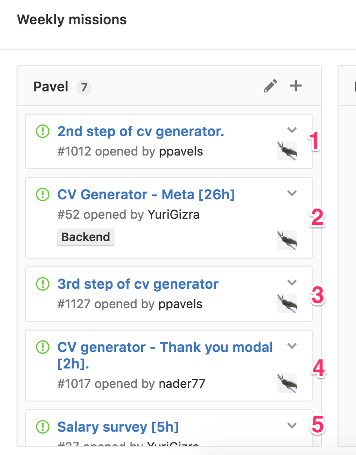

# Escalation and Timeboxing

The goal of this chapter is to clarify Gizra’s core project management processes, and the roles of the Account Managers, Team Leads, Developers, and QA.

## Activity Process

### Create a weekly plan

On Thursdays, the Account Manager creates a weekly plan and Team Leads assign the tasks to the developers. Every Developer gets his/her tasks for the next week.

Note: the priority is indicated by how high up the task is on the list.

QA's list of activities is an exception. They have their own board and it is based on an ongoing list - not a weekly plan. The goal is to clear the list as quickly as possible per the priorities set.

### Review and prepare the tasks

On Sunday, Developers go over their tasks and do the following:  
1. **Understand the task**. Ask question until you do.  
2. **Check time boxing**. If it doesn’t make sense to you, communicate that to your team lead.  
3. **Write user stories** \(where applicable\) **and outline the solution** \(the title in Github \#\# Solution Outline\). If you are not sure about the solution, tag your team lead to review it.

The Team Leads review the outlined solutions, and give input if necessary.

### Write code

As soon as the Developers prepared their tasks, the rest of the week is meant for the  
Developers to write code, and fix bugs as needed. Read [How to submit a PR](https://www.thegizraway.com/how_to_submit_a_pr_-_quick_guide.html).  
Throughout this process, Team Leads review and give direction to solve problems. Account Managers juggle the client's needs and communicate priorities of the tasks.

### Activity types

| Activity Type | Activity is clear | Prep | Plan | Implement |
| --- | --- | --- | --- | --- |
| **Task** | Understand the issue?\* | Check timeboxing.\* | Write user stories and outline solution.\* | Write code and Review \(again and again and again!!!\). |
| **Bug** | Expected vs actual? | Reproduce bug. | List affecting areas with strategies & priority. | Implement strategies. |

\*Weekly Prep \(1st day of week\)

## Escalation Process

## Time Boxing

1. Timeboxing is the **amount of time set to complete a task**.
1. It is a tool to provide a price proposal to the clients and manage our project resources.
1. Timeboxing is based on an **average** skilled developer - NOT according to who will be doing the task.
1. **Escalation in timebox** - An update to an issue should happen about once an hour (update, image, git commit). If you see the timebox is reaching don't wait to the last minute. Reach out to your team lead (technical stuff) or account manager (spec) and communicate it, via a comment on GitHub.

## Report in Productivity

1. Be accurate in reporting! We need real numbers to help us as a company do our best. It's not about nit picking with employees.
2. **Update every day**. This is important for our reporting with the clients.
3. Expectations: in Gizra's 9 hour days, we expect to see 6-8 hours of productive time. Yes, take breaks as needed but when you work, work well!
4. Non-project reporting:

   * **IT issues** - Install issues are taken into consideration.
   * **Training** - Sessions and practice.
   * **Gizra Meetings** - Company wide meetings and personal meetings with Operations Manager.
   * **Business Development** -  This includes any work on gizra.com, blog posts, marketing materials, and RFP materials.

5. Installments and set-ups - this is reported inside the project with the label “Installation and set-up”.

## Team Leads

### Task process

Know the activity process, monitor it, and clear away as many obstacles as possible - Sundays are a critical days. Review the solution outlines written by the developers, and give your input if necessary.

### Escalation process

Understand the escalation process and enforce it - this also means what should not be done, like a developer escalating to another developer. When a developer escalates to you, your responsibility is to provide a direction, priorities where applicable, and training resources if needed.  
Keep to the 1-15 minute time box. If it takes longer, then you are probably doing something you shouldn't - like training them or trying to solve the bug with them. If you find that you need to pay more attention to an escalated issue, release the Developer to work on something else and get back to them with the direction. The goal is to use your and the Developer's resources efficiently. Your example in taking time boxing seriously will trickle down to the developers.

### Training

Make note of the areas where the developers need training help, and communicate this to the Employee training and development person, so she can provide the appropriate resources. It may be personally training the developer\(s\), finding the best online training, or matching them up with a mentor.

### Feedback

Your interaction with the developers is very important.  When a developer does something right, remember to provide them positive feedback - they really need to hear it.  When the developer messes up, tell them - getting real time feedback to where they need to improve is helpful for them and for Gizra. If you see that you need to correct/remind a developer repeatedly on the same mistake, it's time for you to escalate this to Brice/Amitai.

