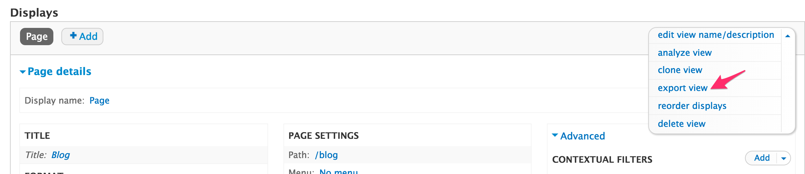
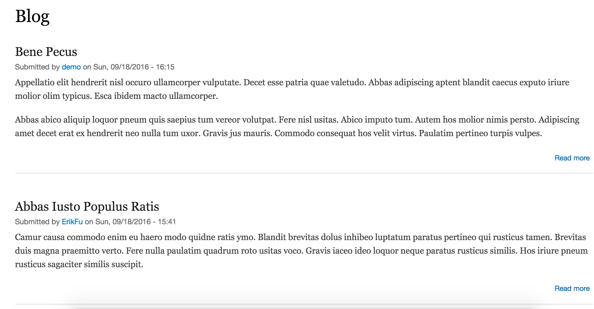
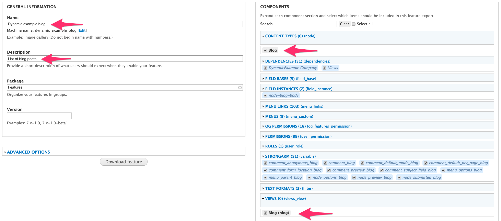
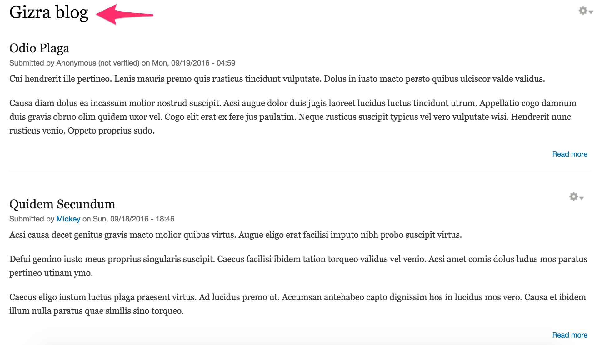
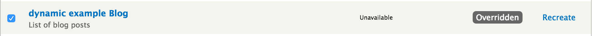
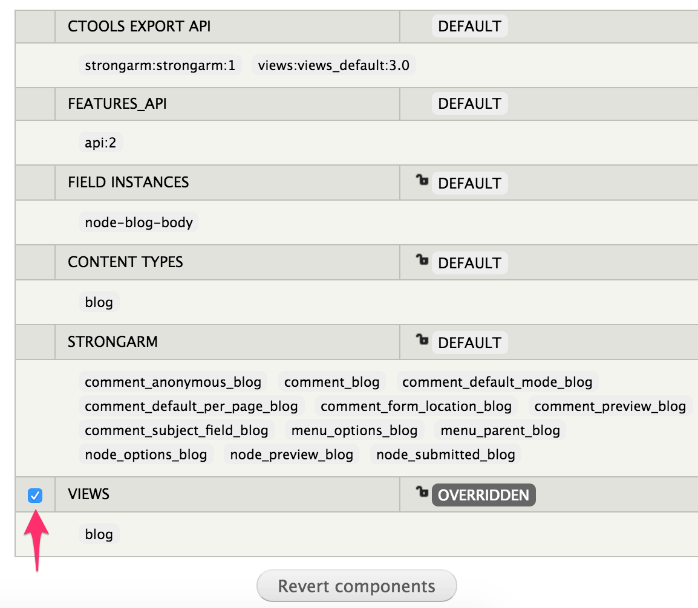
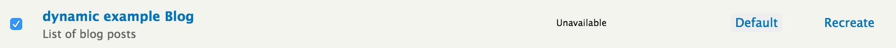

# Features module: how to share site’s config with others?

If you already had a chance to build one or two Drupal sites,  you probably know Drupal site consists of three parts:
**Code** (modules, themes…) stored in files, **Configuration**  (content types, views, panels…) stored in the database, and **Content** (nodes, terms…) stored in the database.

When we are collaborating in the project, building the site together, we want to share our work. As we build Drupal site, define content types, setup Views and Panels, we end up making a lot of configuration changes. These changes stored in DB. Code is easy to share, but there is no easy way to merge changes to DB. So here come our challenge: how to share site’s config with others?

Optional solution: Document all the configuration we made and do them again in the new environment. Well, It's not a very clever way of working. It takes a lot of time and can lead to many mistakes along the way. Lucky for us, there is a way to manually export/import configuration in code, as you can see for example in View options:

Views, content types, panels and some other modules provide this export/import option, But not every modules gives us this option. Additionally, working this way doesn't provide us the ability to know the dependencies of our configuration. For example, when we export View, we need to export also the content type it depends on, otherwise the View won't work. And when the View is complex, there can be more and more configurations that it relies on, how can we be sure we won't miss anythings?
That is exactly why we have Features module!

Features simply package up all of that configuration (components) into a module, and we can use it like any other Drupal module. In another words: Features is a module that creates modules.

## Create a feature

Take a look on a simple example: Here is a web page that display list of blog post. 

It was built from Content type called `Blog`, and a View.
Now we want to export our work and move it to another environment. We can simply create a module (using features module) that contain the blog configurations (Content type and View). 

Let's do it together:

Go to `admin/structure/features/create`.
Give the feature a name. This will be the name of the module, so we always use the project name (Dynamic example in this case) and a reasonable name that tell us what this module use for (Blog in this case). Also write a description that tells more about this module.
In the right area on the screen you need to select the components that should be include in the module (in this case Content type=Blog and View=Blog).
As you can see, Features automatically select for us all the dependencies our module needs to work properly. You can add your own dependencies as you want.

When you done, just click on `Download feature`.
Uncompress the file, and put the module folder under `modules/custom` in the project directory.
Enable the module so Drupal can start using it.

**Attention**: When you make your configurations in DB, then export it as a feature and enable the module, your configurations stored both in code and DB. In that case, we can't be sure our module works exactly how we expected (try to disable the module and you still get the same configuration). The most effective way to make sure all our configuration moved successfully to code, is to start new installation and then enable the module.

## Change a feature

Now we have our Blog feature (module) installed and running in our site. But what if we want to make change in our configuration, for instance change the page title to be 'Gizra blog' instead of 'Blog'?
We can simply go to the View configuration in the UI and change the title.

But where is this change stored? Right, it stored in DB. So now we have the title 'Gizra blog' in DB and the title 'Blog' in code.

Features module noticed this change made to the component and mark it with an `Overridden` state on the Features administration page.

Overridden state means that the configuration in DB is different from configuration in code, and what stored in DB is stronger, so it overrides the code.
This is a situation we need to solve. We can choose to revert to the original code or to update the feature by applying the new changes to it. 

## Revert a feature

Click on the `Overridden` signal, then you will see the component that was override (View in this case because we changed the view title). Check the component you want to revert and click on `Revert components`

Now go back to Features administration page and you will see that the state is `Default`, means the feature configurations in code are the same like in DB.

## Update a feature

When we make changes at the configuration and want to keep them, we need to update the code.
One way is to do it through the UI: click on `recreate` and download the feature again. Then replace the old feature folder in module directory with the new one.
Second and much quicker way is to use Drush. Run `drush fu [feature name]` in Drupal directory (www) and that's it, your feature is updated!

If you go to Features administration page, you will see that the state is `Default` again.

## What to “featurize”? 

In short: All!
Everything we have in our local DB should be in code, so we can share it. 
Of course we can't featurize content. Content needs to be [migrating](https://www.drupal.org/project/migrate).
But how can we decide which components to pack in one feature? Feature is a set of components for a particular use case, so we need to 

for example, If we have site with main menu that links to: 

Gallery - made of Content type, Views and Vocabulary (taxonomy)
Blog - made of Content type, Views and Vocabulary (taxonomy)
About page - made of Content type.

How many features are we going to create from this structure?

We can pack all in one module, but this way it can be 

(conflict)

## Summary

We use the Features module to export the configuration from database to code.
When you create a Feature, you are in fact creating a module. It can be treated like any other module in Drupal.

featurize **all** configurations you have made, and share them with Git. What's left in your local environment does not count.

Keep the guideline: Every Content Type and its associated components (views, Vocabulary, etc.) will be pack in one feature.
To avoid conflict, pack shared components (like vocabulary or fields that use in more then one content type) in separate feature. Use dependencies to connect between features that depend on each others.

