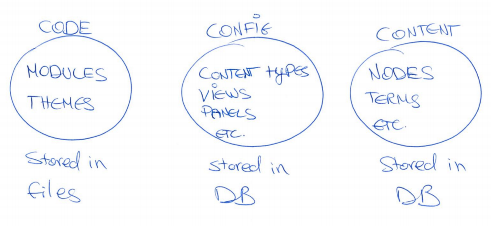
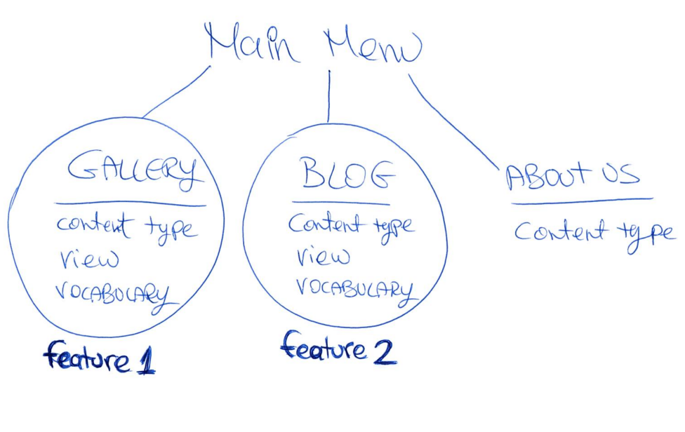
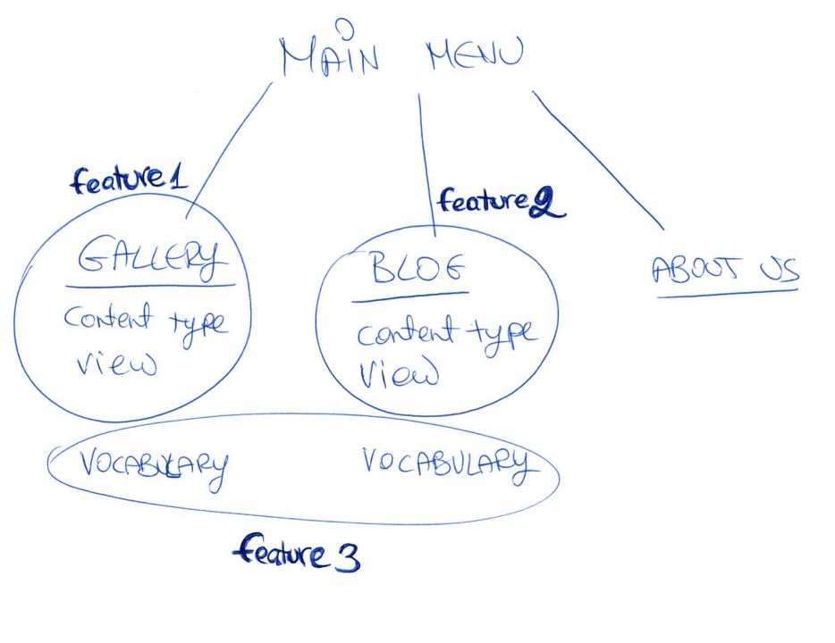

# Features module Drupal 7: how to share a site’s configuration with others?

If you had a chance to build one or two Drupal sites,  you probably already know that Drupal sites consists of three parts:
**Code** (modules, themes…) stored in files, **Configuration**  (content types, Views, Panels…) stored in the database, and **Content** (nodes, terms…) stored in the database.

When we collaborate on projects, build a site together, we often want to share our work. As we build Drupal sites, define content types, setup Views and Panels, we end up making a lot of configuration changes. These changes are stored in the DB. Code is easy to share, but there is no easy way to merge changes to the DB. 

In addition, during the work we move between environments: locally -> dev -> stage ->prod.
Content is going down from prod and config is going up from local. Whatever you have running on your computer has no significance. Only if it can be reproduced and later be pushed to production, then we care about it.

So here is our challenge - how do we share a site’s configuration with others and between environments?

One possible solution is to document all the configurations made and repeat them in the new environment. However, this is not a very clever way of working. It takes a lot of time and there are too many opportunities to make mistakes along the way. 

Another possibility is to manually export/import configuration in code, as you can see from the example in View under the options:

Views, Content types, Panels, and some other modules provide this export/import option.  However, not all modules give us this option. In addition, working this way doesn't provide us with the ability to know the dependencies of our configuration. For example, when we export View, we need to export also the content type it depends on, otherwise the View won't work. And when the View is complex, there can be more and more configurations that it relies on. How can we be sure we won't miss anythings?

Our solution and the most efficient option, is to use the Features module!

Features simply packages up all of that configuration into a module, and we can use it like any other Drupal module. In other words: **Features is a module that creates modules (known as Features).**

## Creating a Feature

Let's use a simple example - a web page that displays a list of blog posts. 

It was built from a content type called `Blog`, and a View.

Now we want to export our work and move it to another environment. We create a module (using the Features module) that contains the blog configurations (content type and View). 

Let's do it together:

Go to `admin/structure/features/create`.
Give the Feature a name. This will be the name of the module, so use a reasonable name that tell us what this module is used for (Blog in this case). The name should be prefixed by the project name (=profile name), so the human name would be Example blog and the machine name example_blog. Also write a description that tells more about this module.
On the right side, you need to select the components that should be included in the module (in this case Content type=Blog and View=Blog).
As you can see, Features automatically selects all the dependencies that our module needs to work properly. You can add your own dependencies as well.

When you are done, just click on `Download feature`.
Uncompress the file, and put the module folder under `modules/custom` in the project directory.
Enable the module so Drupal can start using it.

**Note**: When you make your configurations in DB, then export it as a Feature and enable the module, your configurations are stored both in the code and DB. In this case, you don't know if what you are seeing on the screen is coming from the code or from the DB, so you can't be sure if the module is working as expected. 

The most effective way to make sure all our configuration moved successfully to the code, is to start a new installation and then enable the module. Now, after a new installation, you know that everything you see is from the code.

## Changing a Feature

Now we have our Blog Feature (module) installed and running on our site. But what if we want to make changes in our configuration? For example, change the page title to 'Gizra blog' instead of 'Blog'?
We can simply go to the View configuration in the UI and change the title.

But where is this change stored? Right, it is stored in DB. So now we have the title 'Gizra blog' in DB and the title 'Blog' in code.

Features module noticed this change made to the component and marks it with an `Overridden` state on the Features administration page.

The Overridden state means that the configuration in the DB is different from the configuration in code, and what is stored in the DB is stronger, so it overrides the code.
This is a situation we need to solve. We can choose to revert to the original code or to update the Feature by applying the new changes to it. 

## Reverting a Feature

Click on the `Overridden` signal - you will see the component that was override (View in this case because we changed the View title). Check the component you want to revert and click on `Revert components`

Now go back to the Features administration page and you will see that the state is `Default`, which means that the feature configurations in code are the same as in the DB.

## Updating a Feature

When we make changes to the configuration and want to keep them, we need to update the code.
One way to do this is through the UI: click on `recreate` and download the Feature again. Then replace the old Feature folder in module directory with the new one.
A second and much quicker way is to use Drush. Run `drush fu [feature name]` in Drupal directory (www) and that's it, your Feature is updated!

If you go to Features administration page, you will see that the state is `Default` again.

## What to “Featurize”? 

In short: everything that is _not_ content!

Everything we have in our local DB should be in code, so we can share it.

Of course we can't Featurize content. Content needs to be [migrated](http://www.gizra.com/content/migration-best-practices).

How do we decide which components to pack in a feature? Feature is a set of components for a particular use case, so we need to create Features using common sense.

For example, if we have a site with a main menu that links to: 
1. Gallery - made of content type, Views and Vocabulary (taxonomy)
2. Blog - made of content type, Views and Vocabulary (taxonomy)
3. About page - made of content type.

How many Features are we going to create from this structure?

We can pack everything into one module, but it can be difficult to maintain.  If one person works on the Gallery, and the other makes changes to the Blog, both of them need to recreate the same Feature. So, it makes more sense to pack the Gallery into one Feature and the Blog in another.

But, what if both Gallery and Blog use the same Vocabulary? If we pack the Vocabulary with the Gallery Feature, and also with the Blog Feature, we will get a conflict when we try to enable them both. So, it looks like that the right strategy in this case is to pack the Vocabulary itself into a separate Feature and define the Vocabulary Feature as a dependency in the Gallery Feature and in the Blog Feature.

What about the Menu? 
In D8, the menu it content, so it is best to migrate it. But in D7 we could bundle it in a separate Feature as well.

## Summary

We use the Features module to export the configuration from database to code.
When you create a Feature, you are in fact creating a module. It can be treated like any other module in Drupal.

Featurize **all** configurations you have made, and share them with Git. What's left in your local environment does not count.

Keep to the guideline: Every content type and its associated components (Views, Vocabulary, etc.) will be packed into one Feature.
To avoid conflict, pack shared components (like Vocabulary or fields that are used in more than one content type) in a separate Feature. Use dependencies to connect between Features that depend on each other.