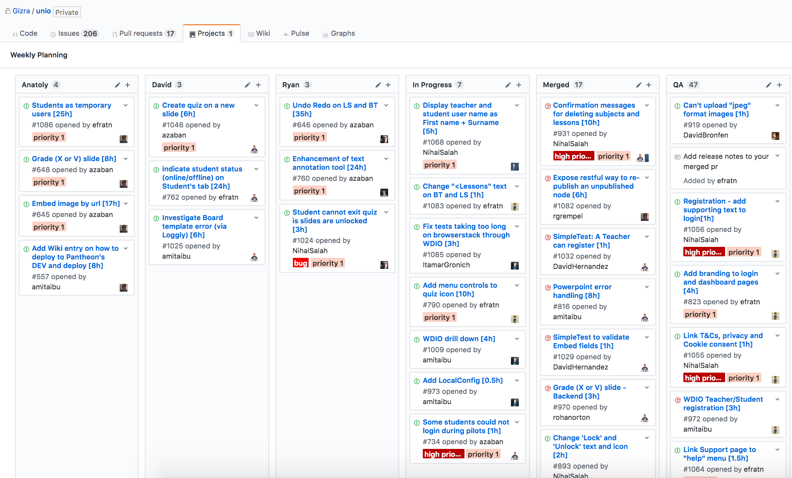
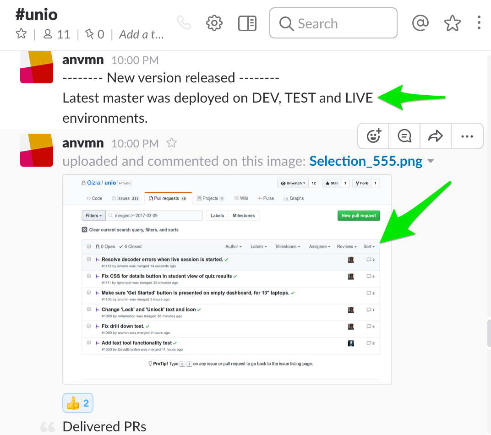

# GitHub Projects board

Every Thursday, the Account Manager creates a weekly plan and assign the tasks to the developers.  

The weekly plan located under the `Projects` tab on GitHub specific project repository.  
There is a separate column for every developer in the project, where they can find their tasks for the next week.
The priority of the task is indicated by how high up the task is on the list.

When developer start working on a task, they drag the issue from their column and drop it in `In Progress` column.  
This way, the Account Manager can know which tasks the developers are working on at any given time.  
When task completed and merged, the person who merged it needs to move the issue from `In Progress` column to `Merged` column.
The same goes for `QA` column.

Important information for the Account Manager that can't be reflect on the weekly planning board, is which tasks are deployed and moved to LIVE site.  
One optional (and partial) solution is to mark the completed issues with `LIVE` label.
Another way to deal with it, is to ask the person who made the deployment, to announce it in Slack project channel, and give a screenshot of all the PRs that deployed. 

