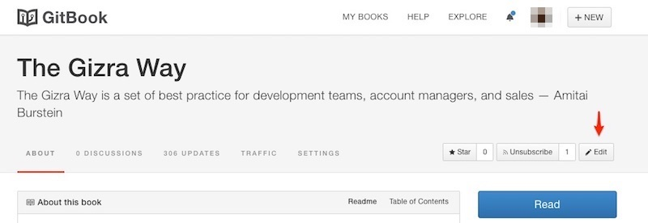
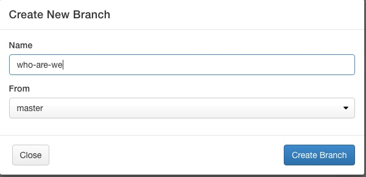
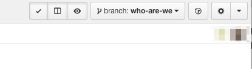
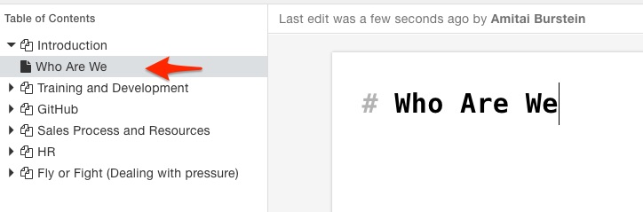
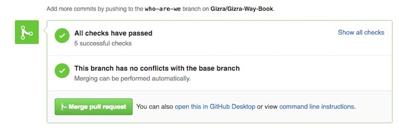

# GitBook & GitHub Workflow

The following chappter assumes you are working with GitBook UI. As a developer you may feel comfortable working with your text editor and command line. Both ways are fine, as long as the end results will be a GitHub pull request.

GitBook's repository is being automatically synced to GitHub, so you may change it in one of them, and it is guaranteed to be reflected in the other.

As a privileged user, start by [editing](https://www.gitbook.com/book/amitaibu/the-gizra-way/details) the book

Create a new branch the have your work on a side branch, which will not be reflected immediately on the officail book. This allows you to go wild with your edits, without the fear of breaking the live site.

GitBook shows you which branch you are currently editing. It is also reflected in the URL. For example, the URL for the `who-we-are` branch would be `https://www.gitbook.com/book/amitaibu/the-gizra-way/edit#/edit/who-we-are/`

You are now on the new branch. You can go ahead and create new articles, update existing ones, or delete. Be Bold.

On GitHub, open a [Pull Request](http://www.thegizraway.com/pull_requests.html), which will make your work visible to other, and allow an easier review.

Once the review is done, and all comments have been addressed, the PR may be merged into the `master` branch, will automatically cause the official book to be updated. It may take a minute or two for the [site](http://www.thegizraway.com/) to show the new content.
