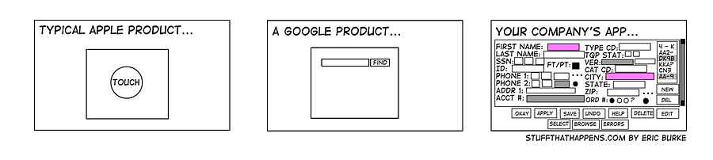

# How to be a Client

How to be a good client is really "how to position yourself to get the most out of your relationship with Gizra (or any development agency, really)." Many, if not most, vendor-client relationships break down down over communication. Since communication is, by definition, a two-sided process, it's essential to understand how to best participate in the dialogue. The Gizra way provides a good foundation for open and transparent communication. What follows is an exploration of that foundation from a client perspective.

##Think about your project as a list of features
In some ways, if you have a project idea, it's counterintuitive to think of it as a set of components. You have a solution to a complex problem with which you are very familiar, and you see the solution as very organic. But even the most simple web solutions have smaller components and it's helpful to think of them in the smallest components possible. Take for instance a simple website that tells us about your company/organization and has a blog (often called a "brochure" site) - even i  this case there are smaller components that we can break out.

* Certainly there is a home page - does that homepage have a listing of the most recent blog posts? does it list the most popular content? Do you have a  highlight area that features a product or service? Are there many, and do you need a carousel?

* Your homepage has a header - does that header look like every other page? It most likely contains a logo, and a menu, possibly a submenu, maybe that submenu drives navigation on your site, so it needs to expand on desktop an an array of mobile devices.

* You have a footer too - you get the idea.

* Does your about page list the members of your team? Are there photos? bios? Can your visitors connect with your team right from this page.

* And then, there's the blog: is there more than one author? will you be blogging about mostly the same topics or do we need to sort content by taxonomy? What metadata about each post is important? the author? the publication date? where it was submitted?

And on, and on... and this is for a very simple, somewhat formulaic site. Most of the solutions that we see at Gizra are much more complex - and probably your idea is too.

If you've been through the discovery and design phase before we meet, you likely have answers to most of these questions, but they could very well be only represented visually. It's a good idea to begin to list them conceptually as well, so that you can do the next step well.

##Think about which features are "must haves" and which you can do without
Once you have thought about your project as a list of features, you are in a better position to prioritize features. Many good projects get sidetracked by two things: (1) a  bloat of unnecessary features that distracts from the critical functions of your project.

(2) cost overruns in the form of too many features for the budget allocated.

You can better position yourself against both of these (or more quickly understand that you need to change the parameters of your project or budget) if you have established a list of discrete features that we can then assign time and cost. Using the example above, You may quickly discover that perhaps the cost of a large submenu that adapts for various screen sizes is not worth the cost of development, and that you would rather drive users through content on the page.

##Be Honest about Budget
With many agencies and clients there is a delicate dance around the question of budget. Clients may not want to reveal their maximum for fear that they can get by more cheaply. Agencies may want to make as much as they can on a project. An honest conversation up front about budget is critical, as it is a key determinant in the scope of a project.

Clients should much prefer to work with agencies that ask about project budget up front (often in their contact form). And they should continue to work with agencies that make them feel better that they are working within that budget to find the most effective and cost-efficient solution. Gizra likes to find more simple ways to accomplish complex tasks, to use existing technologies or frameworks to get features "for free" so that you can do more for less. We believe that this is not only the right way to work, but that it brings us more business.

Think of it this way: if you don't think you can trust an agency to give them your budget, call someone else. If an agency doesn't ask you about your budget in your first conversation, also call someone else.

## Have good background knowledge about the ways your project may achieved
You don't need to be a expert in all of the technology available for your project, but it's a good idea to have some working knowledge of what's out there. You aren't the technical expert, but you are the expert on your web solution, so you should have some understanding of the ways in which solutions like yours have been addressed. It puts you in a better position to ask clarifying questions (see below) and allows you to be a part of technical decisions in your project (some of which are made before you even begin).

## Ask a lot of questions
Any time you find yourself not understanding, ask a clarifying question. This is the "two-way street" part of communication. It's your job to be informed about your project, and i't Gizra's job too keep you informed. If at any point, this two-way street feels only one way, that's the time to start asking questions. If you find this happens repeatedly, that might be a good time to set a meeting (or dedicate scrum time) with you project lead to devise a better strategy to keep you fully informed.