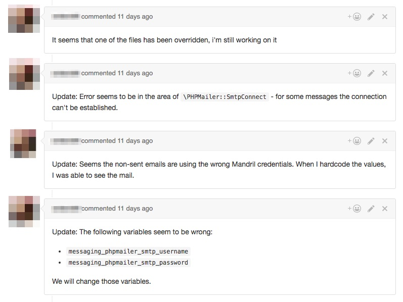

# How to Solve a Problem

Mastering problem solving will get you far. There are some techniques to do it, and it's important to be aware of the fact your day is mostly composed of problems that need to be solved.

A dev who encounters a nasty bug; An account manager working on a price estimation; A sales person trying to reach more leads. These are all big problems, which probably have solutions.

As we will refer to "problem" as "bug" this chapter might seem as relevant only for developer. However the methods and mind set applies to all the roles in the company.

## Finding the cause

Understanding the cause of the bug is the first step and the most important one. Only in very rare cases where a serious bug happens in production and we want to first patch the bug with some quick fix, we will start by working around the problem. But we'll always circle back at finding the cause.

It's better to reflect on the term "the cause". Are you sure the cause you are seeing is the "root cause"?
Systems are always convoluted, and miss identification of the real cause, will cause the bug to appear in different places.

Assumptions are good but need to be taken with a pinch of salt. You shouldn't dive in too deeply just based on your assumption, without verifying it. For example, don't waste time on debugging a certain module before you have asserted that it's indeed the one to blame.

The first step for diving into a system for finding a bug is not using a scalpel, but rather a D9. This means that the first steps don't require slow and tedious debugging of every line of code, but rather big and radical changes. Examples:

Problem: You think a bug is a result of some module. You are not sure exactly which line
Solution: Completely delete the file

Problem: You are not sure if a wrong output of the screen is the result of wrong code in the theme
Solution: Change the theme to under one, thus completely remove all the theme's code from the equation.

Problem: Your new shiny code doesn't work
Solution: Check if it is even invoked. Again, no need to have very delicate debugging. Instead trace the places the code is being called and figure out if is indeed called

Problem: Something that used to work stopped working
Solution: You are in luck, because you can try and find the working instance (e.g. go back in Git's history). If you are able to find a working example, the next step is to pin point the exact time in history (i.e. the git commit) that broke things.

As you can see the gist of the examples is to work out as quickly as possible in getting into right area. From there start pin pointing the problem's cause - there is one specific lines that causes the havoc.

The next question you need to ask yourself, is did it change anything?
If yes, you know you are in the right area, keep zooming in.
If not, you know you are barking at the wrong tree. Use your D9 to squash other parts.

### Time boxing

Like any task you must be disciplined and time box your efforts. Sometimes to _root cause_ can be buried
very deep inside a legacy very complex system. For example, trying to find the root cause of Drupal's from API
can be very challenging. There are times it's needed, but there are cases a work around would be easier.

The way to decide when to move to a work around solution, is the time boxing. If you are about to exceed the time allocated, it might be time to also investigate what are the work around options.

In any case, as always, be sure to reach out to other team members to see if they have a similar experience or a different suggestion.

To emphasize, a work around is a valid solution, but it's kept as the last one. Having a work around is adding a lot of technical debt to the system. Meaning, you have solved a problem, but most likely created new future ones, so be careful with this solution.

## Taking responsibility

Digging into a problem might reveal unexpected stuff. A bug lurking in the shadows might reveal itself as you dive in.
Don't be distracted by it, as our brain can't process two problems at once, however don't disregard it. It is expected that you open an issue, giving some context so you or others may pick up the problem and solve it.

However the term "taking responsibility" refers to owning the code or piece of work that was done, even though it might have been done by others. Nothing is carved in stone, and past developers have not necessarily been smarter than you or aware of this problem.
A system is a leaving thing, that may change. You don't need to work around stuff, you can go ahead and fix the problem. A classic example is CSS code, which becomes bloated very quickly. Don't keep adding new classes, if with a slight more effort you may find yourself changing existing classes or even completely removing them.

## Escalation

You are not alone in the never ending battle field of bugs and problems. Furthermore, there is always a client  that needs to be updated.

In terms of priority, a bug or some service interruption in production site needs to be addressed quickly. We don't mean the a fix can be deployed quickly, but rather communicating with the client and updating them about the resolution and expected time is crucial.

Here's a real example we had in the past:

In a production site of a client some emails have stopped being sent. That is, some emails were sent, and the others didn't.
The lead developer has started doing some debugging and sent questions to the client, suspecting they have did some configuration change they had access to.
The client has confirmed no config change has been done from their side. It was communicated via GitHub's issue queue.
The developer has re-started their effort in finding the cause. No communication has been done with the client, so now, not only did their site not work correctly, but they also thought we were not having their back.
The developer was responsible also for another project, so the issue was not getting their full attention.
Only after their CEO called after a few days to confirm someone was working on it, which we did, but again a the problem was not found, and once again it was hanging.
After 10 days of, and on the last day of the week just before the weekend, was the issue properly escalated by the developer.

The escalation was simple, an email to lead developers stating the client has a problem for the last 10 days and they are starting to become impatient.

Two hours later the lead developers found the cause, and the issue was solved on production.

---

Let us analyze the above horror story, and try to read between the lines. The fact it need to be escalated quicker is probably trivial by now, but there is more. Lets assume there was such a serious bug we had to re-write a substantial chunk of the system. If the client is kept in the dark, they have a feeling it should be solved in no time. However if we would have explained them the problem, and in terms of setting expectation told them it would take 10-12 days, then they would not be disappointed every day that passed.

That probably one of the big takeaways from this story. The fact it took 10 days, is bad given the fact we were able to solve it within 2 hours once more experienced developers stepped in. But what is bad, is that the client was not aware of the time table, and what is worse is that the effort that have been done were not communicated. So from their perspective, if they don't hear anything from us, they assumed we didn't do any work.

Notice for example how when the lead developer stepped in, 4 different updates in the issue queue were done in the span of two hours. Even though it's very technical talk, it provides internally some context, and to the client it shows something is on it, and some progress is being achieved.

