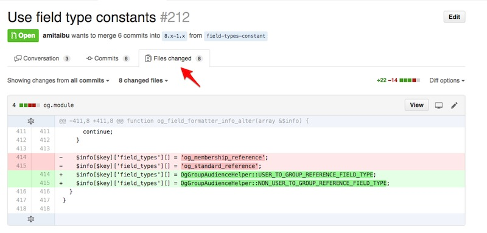

# How to submit a Pull Request

A Pull Request \(PR\) is the way of letting the team lead to know new code is in the making or ready for their review.

## Goal

After reading, you will know how to submit Pull Request \(PR\) for code review.

## Prerequisite

* You understand the project goals.
* You know who is the team lead and account manager.

## The Flow

### Flow outline:

1. **Prepare your tasks for the week**
2. **Write some awesome code** that solves your issue.
3. **Test your work and submit for review**

### Flow in detail:

#### 1. Prepare your tasks for the week

**Note:** _this part should be performed for all your weekly tasks in the first day of the week - this will allow account managers and team leads to review the user stories and proposed technical solutions._

1. **Open your task** on Github: Go to `Project` tab, click on `Weekly Workplan`, under your name you will see all your tasks in the project and their priority \(the top one is no. 1 and so forth\).
2. Read the description, **Check if you understand the issue**, and if you don't, this is the time to  write any questions. _This is important. Keep asking questions until you understand!_
3. **Check the timeboxing** and see if it makes sense to you. If it doesn’t, communicate that to your team lead. _This will help identify early on any issues with the timebox, how well the task was explained, and if you really understand the task. Giving this thought can save you a lot confusion and frustration later on._
4. **Write user stories** \(in [Behat format](http://docs.behat.org/en/v2.5/guides/1.gherkin.html)\), to be used for the QA team and automated tests.
5. If the issue include writing a new feature, write the **outline of the solution** titled \#\#"Solution Outline" in the comment. If you feel unsure, tag your team lead.

#### 2. Write some awesome code

1. On Github: under `Project` tab, move the task to `In progress` column.
2. Make sure your **master branch is updated**.
3. **Create a new branch** named after the issue number with a tiny description. \(ie. 450-fixing-feature\). As soon as you start a new branch, and add new code you should commit and push it, as means of having backup to your code. In case your computer will  break, no work will be lost.
4. **Create PR** with a clear title, prefixed with WIP \(Work in progress\). 
5. In the body of the PR add a reference to the original issue. For example, if the issue is under `https://github.com/Gizra/foo/issues/100` then enter `#100` in the description \(it will automatically be converted to a link\).
6. Assign the PR to yourself.
7. Start coding, **push code regularly** to allow code review during your work. It is considered a best practice to update the issue from time to time \(about once an hour\) with your progress. It can be a screenshot or a one-liner; just enough for the rest of the team to keep in tabs with your progress. Mistakes are avoided by doing so. A screenshot can help detect early on, cases where you are working on the wrong element, or another developers is already working on a similar task. It also helps the Account Managers or Team Leaders to visualize the what the distributed team is doing.
8. When your work is done and ready for review, **push the final code**. 

#### 3. Test your work and submit for review

A pull request is ready for review whenever you feel it's ready for a review by the team lead, and is ready to be merged into the `master` branch.

1. Go over the user stories and **check your work** at least once for each case. If this is a bug make sure to include in your testings the _**exact**_ scenario of the bug, and to add this scenario to the user stories.
2. **Code review yourself.** The rule of thumb of changing a PR to ready for review is that you need to be sure the PR has the required changes. Not more not less. Review your own work, by checking the `Files changes` tab: 
   Every change on every file and every character should be a change you can explain and desire. This part is crucial as newbies may often commit unrelated code changes. If such unrelated code was committed, it should be removed.
3. Attach final screenshots and/ or explanation needed for the team lead to quickly understand what the PR is doing.
4. make sure travis returns green \(both with Coder and Tests\)
5. **When all done:** Remove the WIP from the PR title. Assign it to the Team Lead for review. Add `ready for review` label.

#### Use the Checklist

When a PR is created, this checklist will automatically be in the first comment. **Before you submit the PR**, please make sure that you did all the following things.

\[ \] - Merge latest code from the master branch.  
\[ \] - Code review yourself.  
\[ \] - Comment on all functions and comment complicated part of your code, be generous.  
\[ \] - Security check your code.  
\[ \] - Add a screen-shot/gif  
\[ \] - Test your code, using the user stories, Add screenshot to the user story results.  
\[ \] - Add a wiki entry when needed, or release protocols.  
\[ \] - Assign for review.

## Here are some things to keep in mind while coding:

### Coding standard

Make sure you know the coding standard required for the language - the coder should run on your files to confirm this.

* [How to setup coding standard in PHPStorm](https://www.jetbrains.com/help/phpstorm/2016.2/configuring-code-style.html#d1056806e40).
* [Drupal coding standard](https://www.drupal.org/docs/develop/standards).

### Issue tracking and Bugs

Use Github issue tracking to document your work and progress when necessary, especially when working on bugs. This will allow other developers to help, and stakeholders to track your progress.

### Focus and Follow Up issues

During your work try to stay on track, for bugs if you feel a quick solution can be thrown before dipping into a proper solution, please consult with your team lead.  
Any indirect issue you find during your work should be translated to a new follow up issue, and documented in your GH issue. Make sure you don't have more than 2 or 3 missions in progress. Stay focused.

### Github Issue Flow

Typically an issue is opened by the account manager, or by the QA team/customer, the basic rule of thumb is that an issue is closed by the person who opened it.  
This mean you can close issues opened by you when they are done and deployed after validation, and other issue should be assign to the account manager.

Account managers or Team leads are responsible to assign issues to the team members.

### Automated Tests

Check with your Team Lead if a test should written or write one if you have extra time out of your time box.

### How deal with a problem

Read [How to solve a problem](https://www.thegizraway.com/how_to_solve_a_problem.html).

