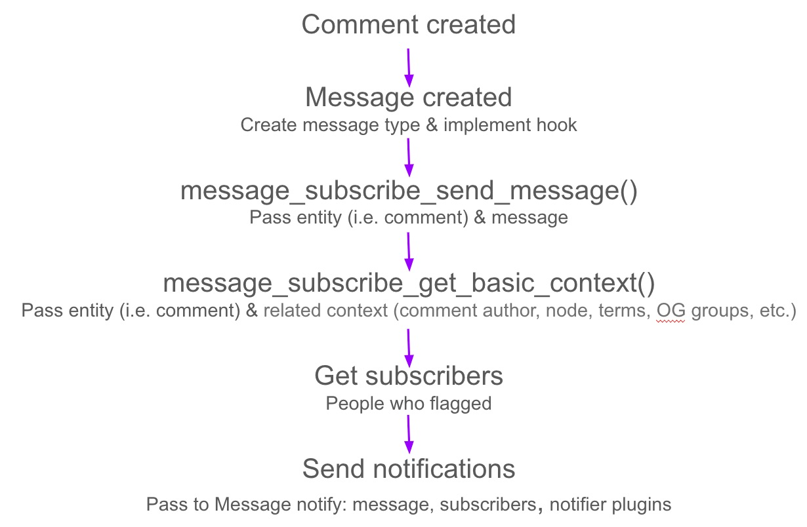

# Message stack

The message stack contains three modules: [Message](https://www.drupal.org/project/message), [Message Notify](https://www.drupal.org/project/message_notify) and [Message Subscribe](https://www.drupal.org/project/message_subscribe).

### Highlights

Message represents a record of event that occurred in the system. Message is an entity - `message` to `message type` is like `node` to `content type`. We can define different message types for different events.

Message type is **fieldable**, meaning we can store data with a message.

Message type supports **view modes**. We can display different partial of the same massage ID in different ways.

Message module supports **localization** (with Local module, part of Drupal core), so message types can be created to support multilingual web sites.

Message types can be created with **tokens** (with [Token](https://www.drupal.org/project/token) module), so the messages can be dynamically generated.   
We have two types of tokens:  
Token marked by [....] (i.e. `[message:field-node-ref:title]`) will be replaced on-the-fly (each time the message text is rendered).  
Token marked by @{....} (i.e. `@{message:user:name}`)replaced at the first time the message is displayed the replaced text is stored with the message record in the database.

Message module does not provide a way to create messages. We need to leverage different **Drupal hooks**, depending on the requirements. During development we can use [Message UI](https://www.drupal.org/project/message_ui) to create a message instance through the user interface.

**Message Notify** module provide the ability to notify user when messages are generated. We determine the method for sending a message via a notifier plugin (email, sms, etc.)

**Message Subscribe** module provide the ability to notified users who subscribe to content. The module leverages the [Flag](https://www.drupal.org/project/flag) module, which provides subscribe functionality to users. It determines the context of the message (comment, node, group etc) and collates all users who have subscribed to (flagged) objects in this context.

### Work flow
For example, users can be notify anytime somebody comment on content they subscribed to (or involved in that content, by context).  
The work flow will look like this:

### Read more

You can read more about Message Stack in the references above:   
[Webinar with Amitai](https://vimeo.com/63919900)  
[Module documentation](https://www.drupal.org/node/2180145)  
[Gizra blog](http://www.gizra.com/tags.html#Message-ref)
