# Views Module

Simply explained, the Views module is a query builder. But, it is not simple at all - in fact, Views is a very powerful and complex tool that has a lot of options - that sometimes can be very confusing. But no worries, when you understand the basic logical, it becomes easy to dive into it.

As a query builder, there is a SQL query behind it. If you are interested in seeing the query in the UI, while building the View, you can go to `admin/structure/views/settings` and check the `Show the SQL query` option.

In this training we will create a View that will display a list of blog titles with a content type called `Blog` with basic fields: Title, Body, and generated demo content.

To start building a new View, go to `admin/structure/views/add`.

This form give us some main View definitions: 
* Set the 'View name' and 'Description' - be kind and describe it shortly and clearly, so others can understand what this View shows. 
* In the ‘Show’ field, define what kind of information the View will show. This selection determines the main table in the DB that the View will use to retrieve data and **it cannot be changed later**.

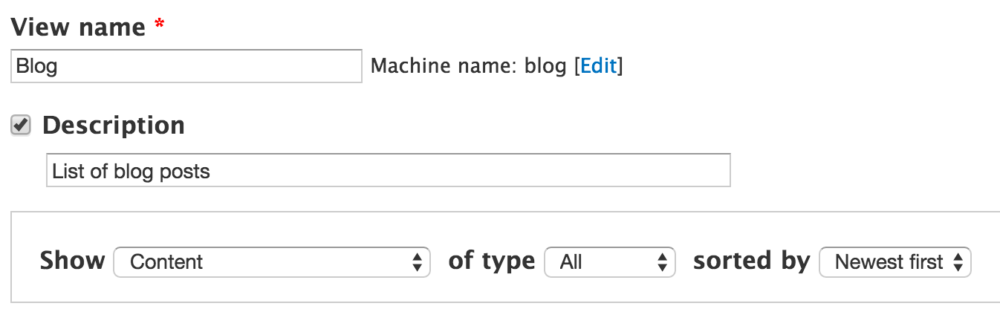

In this View we want to display a list of blog titles, so we select to show `Content` (nodes). Since we chose Content, we also get the option to select the content type. Although we know we need to choose the `Blog` content type, let’s leave it `All` for now, so we can practice how to define that filter in the edit View page.

There is also the possibility to create a page and a block in this form.

Our Blog list will display on a page, but we will create it in the next step (just for you to see how we define this in the View edit page.) So leave the page checkbox unchecked.
When finished, click `Continue and edit` button.

This brings you to the View edit page. Be aware that the View is not saved until you click on the `Save` button, so I recommend saving it immediately and throughout your work on the view.

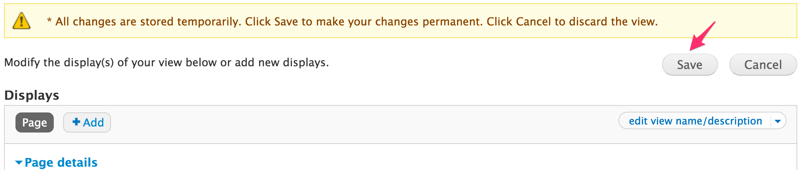

## Displays

Any View can contain multiple displays of different types - page, block, feed, etc. Some contributed modules extend the displays options that allow us to create a single View that displays the same content in multiple ways - different formats, filters, etc. For example, we can create a View that shows a list of blog posts. In the `page display` we will show all the nodes with their title and teaser, and in the `block display` we will show only the titles of the last five posts.

In this training we want to display a page with a list of blog titles, so click on the `Add` button in the displays section (near the `Master`) and select `Page`. Now you can see that we have two displays: `Master` and `Page` (if you can't see the Master display, go to and check the `Always show the master display` under options).

Every web page needs to have a path, so click on the `No path is set` and specify the URL. Under this _Page setting_ section you can also link the page to a menu and define an access rule for the page.
Next, click on `None` under the _Title_ section and specify the page title, like Blog.

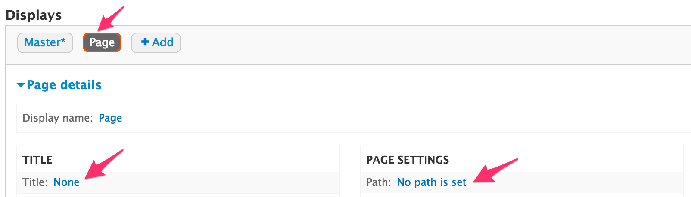

As you can see, when you fill the title name, you get the choice to where it is applied: **All displays** or only **This page**. This choice comes up almost in every change you want to make in the View.  The default selection is All displays, so be careful when you have multiple displays. Always make sure you make changes to the displays you want to make changes to.

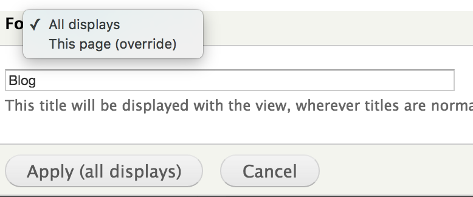

## Format

Under the _Format_ section, we can define how the View will display. Let's stick with the default one: `unformatted list`.

Then, we can specify which parts of the content will display. We need to choose between `fields` or `content`.

When you choose `fields`, it means that you can choose which fields from the content type the View will display. In our case, we want to display the post title, so under _Format_ we will select to show `Fields`, and under the _Fields_ section, we will leave it `Content: Title` (the node title) which is the default.

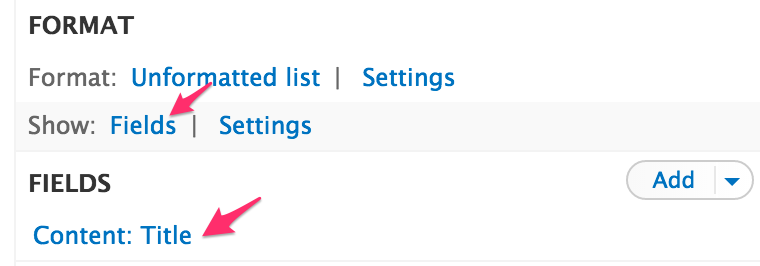

Another option is to show `Content`.

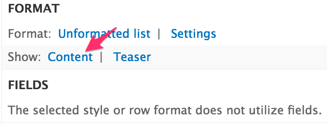

Although we won't choose this in our case (because we want to display only the node title field), here is an explanation of the Drupal view modes.

We can display every content type in a few view modes (full content, teaser, etc). For each view mode, we can define the way the content will be displayed. For example, in the `teaser` view mode we can display the _Read more_ link to the node, but in the `full content` view mode, it is not necessary.

## Fields

In this training we want to display a list of blog titles, so we choose to show the `Content: Title` under the _Fields_ section. To add more fields, click on the `Add` button and select the field(s) you want to add. There are a lot of field types available, and lots of configuration options - you can play around with it and discover yourself.

## Filter criteria

In this section we define by what criteria we filter the data in the query. As you can see, it  already contains one filter to shows only content that is published. But this is not enough, because we want to display only the blog titles, and not the titles of all the nodes in the site. So we have to add a second filter to show only the nodes of the type `Blog`.
Click on the `Add` button, select `Content: Type`, then choose the `Blog` option.

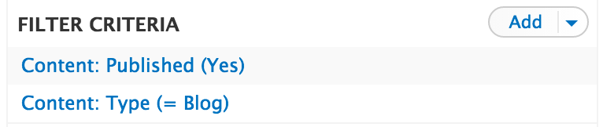

Those of you who are familiar with SQL can look at the bottom of the screen and see the query built from this View (that's if you set the `Show the SQL query` in the View settings).

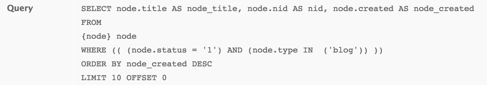

Below the Query you can see preview of the View results.

## Relationships

Let's continue to the _Advanced_ section. Now we want to also display the author name of the blog post. 
We need to go to the _Field_ section and add the correct field. But when we search for this field, we see only the `Author uid`, but we want to show her name.

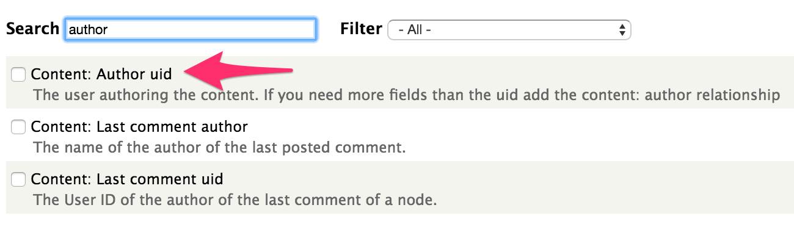

The reason is that the `Author name` field doesn't exist in the content table we selected when we first started to define the View. So we need to bring it from another table - in this case, the user table. The _Relationship_ section is there for that purpose.  In SQL language, it means that table A (in this case `content`) will join with table B (in this case `user`) in order to get data related from both tables.

Click on the `Add` button in the _Relationship_ section and choose the `Content: Author`. 

Notice the `Require this relationship` check box. When we check it, only blog posts that contain author will show. In Drupal, every content has an author, so it isn't relevant in this case, but it is good to know this option exists.  

Now, if we go and add a new field under the _Field_ section, we can select the `User: Name` field. Look at the View preview, and you will see it displayed.

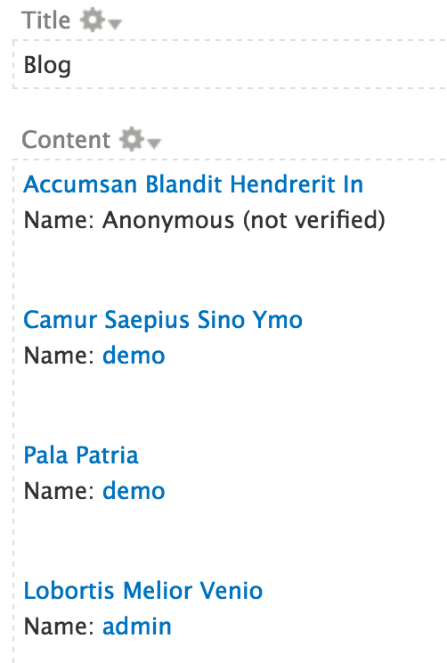

In the configuration of the field we can, of course, change the label to Author instead of Name.

## Taxonomy

Let's take a break from the View configuration, and add new requirements to our Blog page. Don't worry, we will continue later with the View.

We want our blog posts to be classify by tags. Then we want the ability to display, in our View page, only posts that are classified by a specific tag.

The Taxonomy module allows us to classify content. All we need to do is create a vocabulary and provide terms in it. The terms structure can be flat, or hierarchical with parents and children.

For example, let's assume our blog is about movies, and we want to classify the content by movies categories like: Action, Drama, Comedy, etc.

Go to `admin/structure/taxonomy/add` and create a new vocabulary called `Movies categories` with some terms.

Now we need to connect between the content type `Blog` and the vocabulary `Movies categories` so we can classify the nodes (Blog posts) with the terms (Movies categories). 

We know the entity `Blog` and the entity `Movies categories` has a relationship, but what refers to what?
Let's ask the million question. If you don't know what this is, please read [How to approach a new task](https://www.thegizraway.com/approach_data_structure_task.html).

Question 1: Can one category classify more than one blog post? Yes.

Question 2 (The Million Question): Can and should one single category refer to a million blog posts? No, we don't want that.

Now ask the same questions from the other direction:

Question 1: Can one blog post be classified by more than one category? Yes.

Question 2 (The Million Question): Can and should one single blog post refer to a million categories? 
This is where reality dictates the answer. While in theory a blog post could reference a million categories, we know that this won't be the case. A typical blog post will probably have a single or few categories. So, it is safe to say that based on reality, the blog post refers to the category.

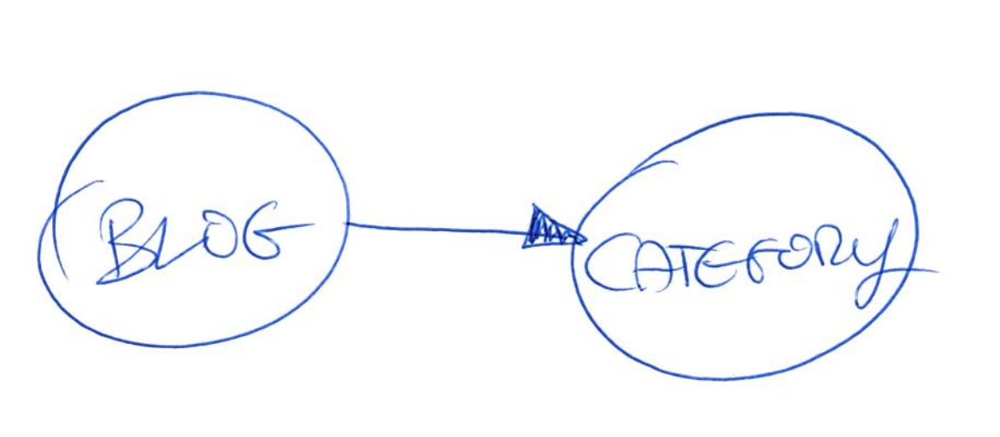

Go to the content types administration page and add a new reference field to `Blog` content type.

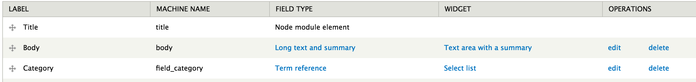

Now let's go back to our View. The requirement is to have the ability to display a page that lists only posts that are classified by a specific category.

## Expose filters

Instead of setting the filter value, we can expose the filter to end users and give them the ability to select their required value. Add `Content: Has taxonomy term` under _Filter criteria_ section and in the setting of the filter check the box `Expose this filter to visitors`.

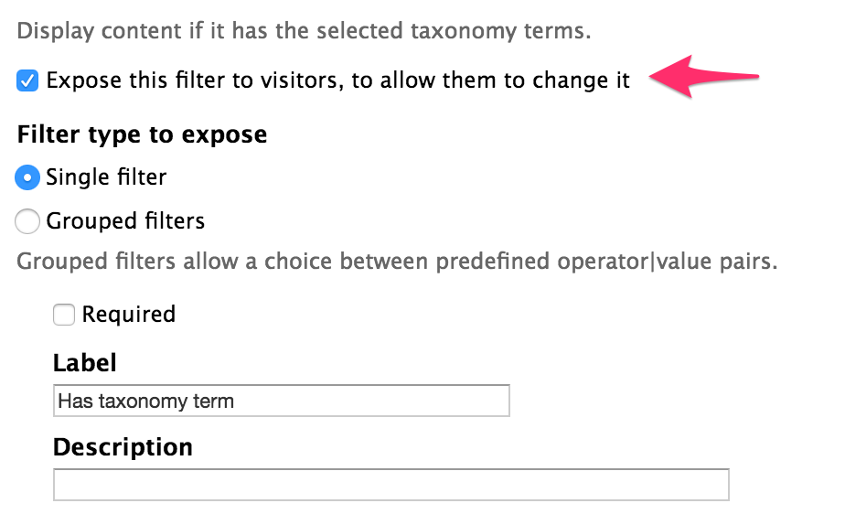

Now, if we go to the Blog page, we will see on the top of the list the option to choose the category.

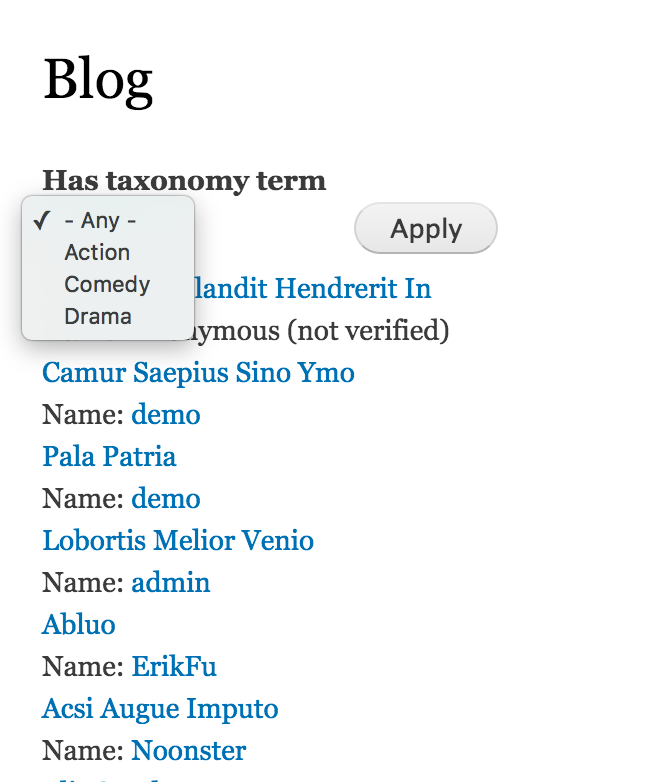

But what if we don't want the end users to select the category, and instead want them to go directly to the page that lists their favorite movies category? For that we have contextual filters.

## Contextual filters

Under the _Advanced_ fieldset you can find the _Contextual filters_ section. Contextual filters are like regular filters, but instead of setting the filter value, it will be taken from context (usually from the URL) when we run the View.

The filters values pass as arguments through the URL. The first filter will be the first argument, the second filter will be the second argument, etc.
In our URL, it will look like this:

> /blog/2/1

`blog` is the view path, `2` is the first argument and `1` is the second argument.

So let's remove the `Content: Has taxonomy term` filter under _Filter criteria_ section, and add it to _Contextual filters_ section.

For the first step, we need to tell the View what to do when the filter value **is not** in the URL. In this case, when no category (taxonomy term) pass through the URL we want to display all the blog posts.  

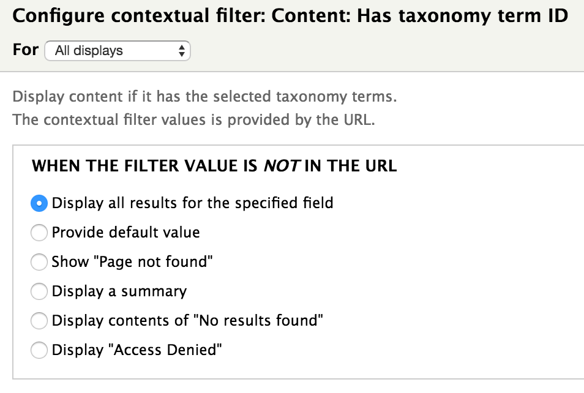

The next step is to tell the View what to do when the filter value **is** in the URL.

We can override the title of the page. So it won't be Blog as we define at the _Title_ section, it will be the name of the category.

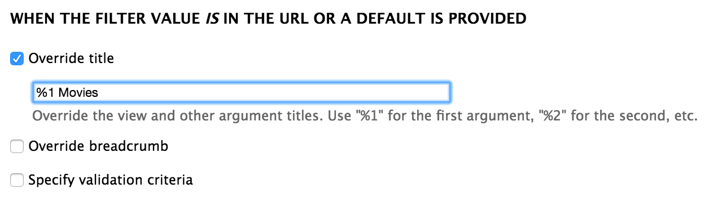

We can also validate the filter value to make sure we only get terms from `Movies categories` vocabulary.

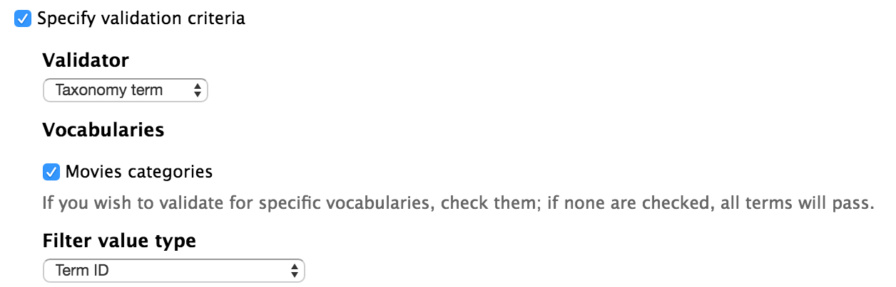

Save the View and go to page `/blog/3`. You should see this screen, because `3` is the `Comedy` term id:

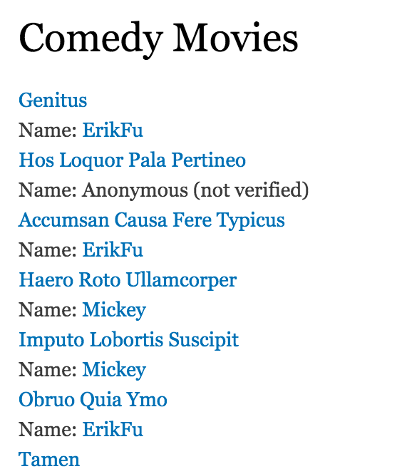

You can go and add more contextual filters. The order you put them under the _Contextual filters_ section will determine which will be the first argument, the second argument, etc.

Additionally, we can use contextual filters not just in the URL context. For example let's add `Content: Author uid` filter, and under `WHEN THE FILTER VALUE IS NOT IN THE URL` select `Provide default value` with the type `User ID from logged in user`:

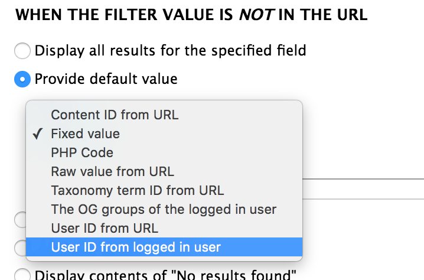

The result will be that when we go to page `/blog/3` we will see a list of blog posts classified by `Comedy` term and written by the logged in user.

